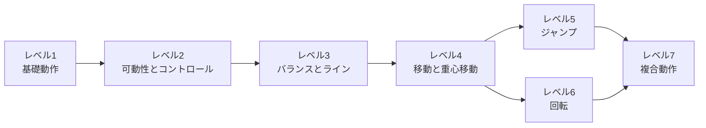
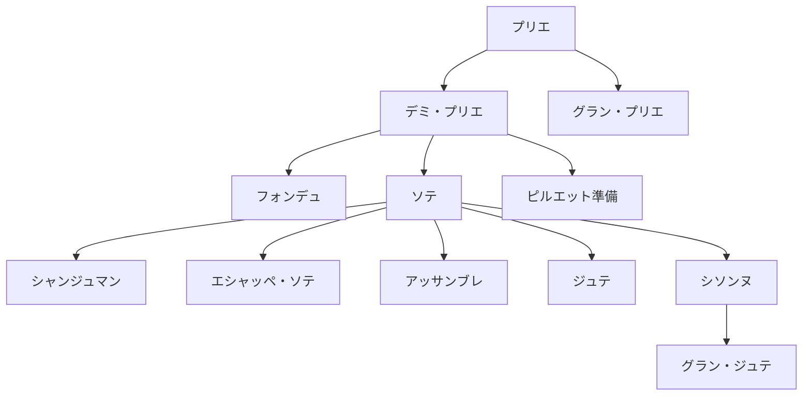
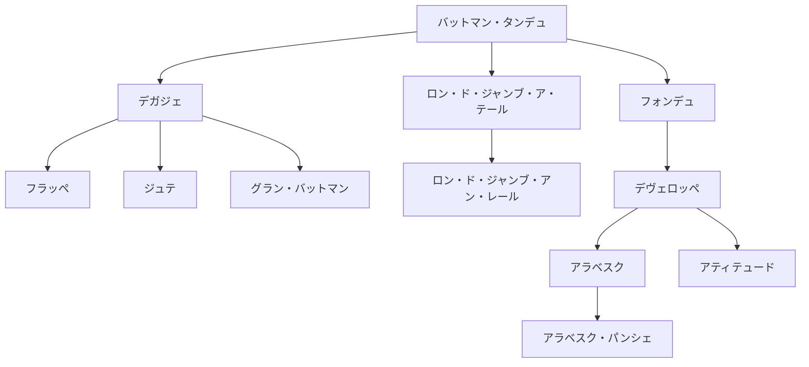
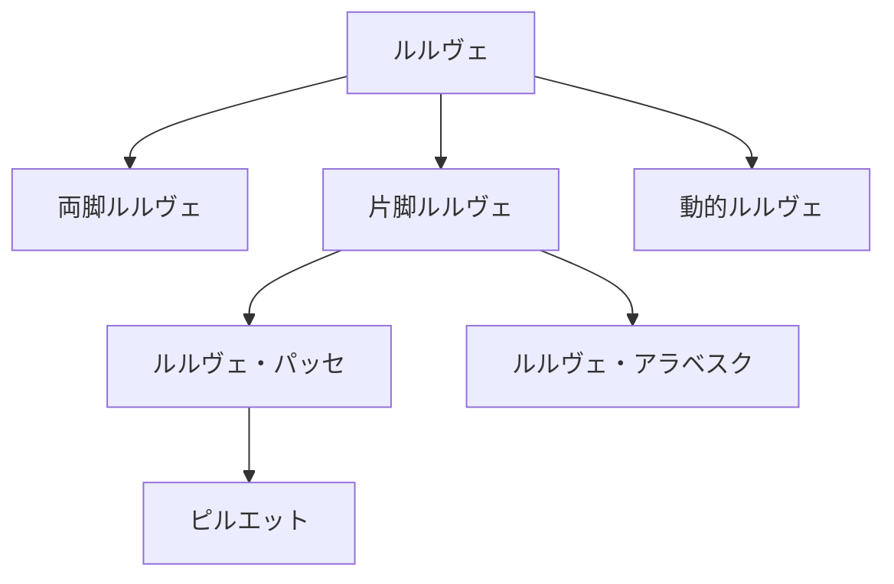
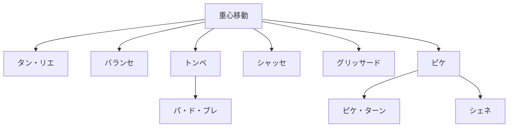
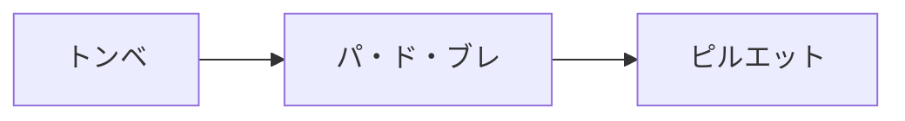
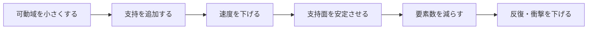
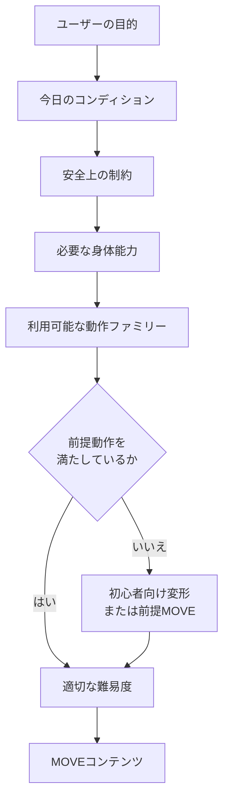

# BDX バレエ動作体系 v1.0

> 一般ユーザーからバレエ経験者までをつなぐ、BDX MOVEの動作基盤

> **重要な前提**  
> 本資料は特定流派の教授法を再現するものではなく、BDXが一般ユーザー向けにバレエ動作を体系化するための分類である。ワガノワ、RAD、チェケッティ、フランス派などでは、用語、教授法、細部の考え方に違いがある。複数の呼び方がある場合は、日本国内で理解しやすいカタカナ表記をBDX上の正本として採用する。

---

## 目次

1. [BDXにおけるバレエの考え方](#1-bdxにおけるバレエの考え方)
2. [BDXバレエ動作体系 全体図](#2-bdxバレエ動作体系-全体図)
3. [レベル1：基礎動作](#3-レベル1基礎動作)
4. [レベル2：可動性とコントロール](#4-レベル2可動性とコントロール)
5. [レベル3：バランスとライン](#5-レベル3バランスとライン)
6. [レベル4：移動と重心移動](#6-レベル4移動と重心移動)
7. [レベル5：ジャンプ](#7-レベル5ジャンプ)
8. [レベル6：回転](#8-レベル6回転)
9. [レベル7：複合動作](#9-レベル7複合動作)
10. [Progression Tree](#10-progression-tree)
11. [BDX基本動作18](#11-bdx基本動作18)
12. [BDX基本動作・発展動作・バレエスキルの分類](#12-bdx基本動作発展動作バレエスキルの分類)
13. [初心者向けスケーリング](#13-初心者向けスケーリング)
14. [Movement Ontology](#14-movement-ontology)
15. [Personalizationとの接続](#15-personalizationとの接続)
16. [AI推薦例](#16-ai推薦例)
17. [コンテンツ制作への利用方法](#17-コンテンツ制作への利用方法)
18. [今後の発展](#18-今後の発展)

---

## 1. BDXにおけるバレエの考え方

BDXでは、バレエを「難しい技を習得するためのもの」としてだけ扱わない。バレエの世界で培われてきた姿勢、支持、重心移動、バランス、跳躍、回転、協調といった身体操作を、一般ユーザーの日常的な身体づくりに応用できる形へ翻訳する。

高度な動作を一律に排除するのではなく、同じ動作を次の変数で段階化する。

- 可動域
- 支持方法
- 支持面
- 速度
- 反復回数
- 衝撃
- 複雑性
- 移動の有無
- 腕、頭、視線の追加

たとえば、デミ・プリエは単独で終わる動作ではない。

```text
デミ・プリエ
    ↓
デミ・プリエ＋ポール・ド・ブラ
    ↓
デミ・プリエ＋ルルヴェ
    ↓
ソテ
    ↓
ジャンプ動作への発展
```

この考え方により、一般ユーザー向けの小さな動作と、経験者向けの発展動作を同じ体系の中で扱う。

### BDXの立場

- バレエの伝統や文化を尊重する。
- 特定流派の教授順序を唯一の正解とはしない。
- 目的だけで動作を直接推薦しない。
- 高難度動作を一般ユーザーへ無条件に推薦しない。
- 医学的な診断、治療、効果保証を行わない。
- 身体科学上の確認と、バレエ技術上の専門監修を分ける。

---

## 2. BDXバレエ動作体系 全体図

| レベル | 動作 | 役割 | 取得する内容 |
|---:|---|---|---|
| 1 | 基礎動作 | すべての土台 | 姿勢、支持、脚と腕の基本操作 |
| 2 | 可動性とコントロール | 動きながら軸を保つ | 動脚と支持側を分けて扱う力 |
| 3 | バランスとライン | 身体ラインをつくる | 片脚支持、姿勢保持、全身協調 |
| 4 | 移動と重心移動 | エクササイズから踊る動きへの橋渡し | 空間の中で身体を運ぶ力 |
| 5 | ジャンプ | 動的負荷を扱う | 床を押す、空中へ移動する、着地する力 |
| 6 | 回転 | 片脚支持と方向転換を統合する | 軸を保ちながら方向を変える力 |
| 7 | 複合動作 | 動作を「文章」にする | 複数動作を連続させる力 |



> **レベル4の重要性**  
> レベル4は、プリエやバットマン・タンデュのような「その場のエクササイズ」から、身体を空間の中で運ぶ「踊る動き」へ移る橋渡しである。ジャンプや回転を始める前に、重心を移し、次の支持脚へ安全に乗り換える能力を扱う。

### 動作仕様表の読み方

各動作は、概要とともに、主に使いながらトレーニング上の効果が見込める身体の箇所を表示する。記載した箇所への効果を保証するものではなく、MOVE制作時に意識する領域を示す。

- 分類：A＝BDX基本動作、B＝BDX発展動作、C＝バレエスキル
- 監修欄の「●」は鈴ちゃんによる専門監修対象を示す

---

## 3. レベル1：基礎動作

身体の姿勢、支持、基本的な脚や腕の操作を身につける段階。

### 動作仕様

| 動作名 | 分類 | 動作概要 | 効果が見込める箇所 |
|---|:---:|---|---|
| デミ・プリエ | A | 両脚で支持し、姿勢を保ちながら膝と股関節を曲げ伸ばす | 下半身、股関節、膝関節、足関節、体幹 |
| グラン・プリエ | B | より大きな可動域で沈み、立位へ戻る | 下半身、股関節、膝関節、足関節、体幹 |
| バットマン・タンデュ | A | 支持脚を保ち、足先を床から離さず一方向へ伸ばして戻す | 下半身、股関節、足関節、足部、体幹 |
| デガジェ | A | バットマン・タンデュから足先を床面より離して素早く出し戻す | 下半身、股関節、足関節、体幹 |
| ルルヴェ | A | 足裏全体の支持から踵を上げ、軸を保って戻す | 下半身、足関節、足部、ふくらはぎ、体幹 |
| ポール・ド・ブラ | A | 姿勢と呼吸を保ちながら腕を滑らかに運ぶ | 上半身、肩周辺、腕、体幹 |
| カンブレ | A | 軸を失わない範囲で上体を前後または側方へ動かす | 体幹、上半身、股関節 |
| エポールマン | B | 肩、頭、視線と身体の方向を協調させる | 上半身、肩周辺、首周辺、体幹 |

### Progression・Safety

| 動作名 | 前提となる動作 | 初心者向け変形 | 次につながる動作 | Safety上の配慮 | 監修 |
|---|---|---|---|---|:---:|
| デミ・プリエ | 安定した立位 | 浅い可動域、椅子やバーで支持 | フォンデュ、ルルヴェ、ソテ | 膝と足先の方向を無理なくそろえ、痛みのない範囲にする | ● |
| グラン・プリエ | デミ・プリエ | 可動域を小さくし、支持を使う | 深い重心移動、アダージオ | 深さを目的にせず、姿勢と足部支持が崩れる前に止める | ● |
| バットマン・タンデュ | 安定した立位 | 小さい可動域、支持あり | デガジェ、ロン・ド・ジャンブ・ア・テール | 股関節の外向きを足先だけで強制しない | ● |
| デガジェ | バットマン・タンデュ | 足を低く、ゆっくり行う | フラッペ、ジュテ、グラン・バットマン | 支持脚と骨盤の安定を優先し、反動を小さくする | ● |
| ルルヴェ | 安定した足部支持、デミ・プリエ | 両脚、低い高さ、支持あり | 片脚ルルヴェ、ルルヴェ・パッセ、回転準備 | 足部が不安定な時は高さや反復を減らす | ● |
| ポール・ド・ブラ | 安定した姿勢 | 腕だけを小さく動かす | プリエとの組み合わせ、エポールマン | 肩を過度に上げず、呼吸が止まらない範囲にする | ● |
| カンブレ | 安定した姿勢、体幹保持 | 小さい可動域、前方と側方から始める | アラベスク、アラベスク・パンシェ | 腰部だけで反らず、違和感があれば可動域を減らす | ● |
| エポールマン | ポール・ド・ブラ、姿勢保持 | 頭と視線だけを追加する | アダージオ、アンシェヌマン | 首を急に動かさず、方向変化を段階的に追加する | ● |

---

## 4. レベル2：可動性とコントロール

片脚を動かしながら、骨盤、体幹、支持脚を安定させる能力を高める段階。

### 動作仕様

| 動作名 | 分類 | 動作概要 | 効果が見込める箇所 |
|---|:---:|---|---|
| ロン・ド・ジャンブ・ア・テール | A | 足先で床上に弧を描き、股関節から脚の方向を変える | 下半身、股関節、足関節、体幹 |
| フォンデュ | A | 支持脚と動脚を協調させて曲げ、伸ばす | 下半身、股関節、膝関節、足関節、体幹 |
| フラッペ | B | 動脚を素早く伸ばし、明確に出し戻す | 下半身、股関節、足関節、足部、体幹 |
| プティ・バットマン | B | 膝の位置を保ち、下腿を細かく切り替える | 下半身、股関節、膝関節、足関節、体幹 |
| パッセ | A | 片脚を支持脚の近くに通過させて運ぶ | 下半身、股関節、膝関節、体幹 |
| ルティレ | A | 片脚を支持脚の膝付近に保持する | 下半身、股関節、膝関節、体幹 |
| デヴェロッペ | A | 曲げた動脚をコントロールしながら一方向へ伸ばす | 下半身、股関節、体幹 |
| グラン・バットマン | A | 動脚を大きく振り上げ、制御して戻す | 下半身、股関節、体幹 |
| ロン・ド・ジャンブ・アン・レール | B | 動脚を空中に保ち、下腿または脚で弧を描く | 下半身、股関節、膝関節、体幹 |
| ロン・ド・ジャンブ・ジュテ | B | 脚を投げ出すような動きと弧の方向変化を組み合わせる | 下半身、股関節、足関節、体幹 |

### Progression・Safety

| 動作名 | 前提となる動作 | 初心者向け変形 | 次につながる動作 | Safety上の配慮 | 監修 |
|---|---|---|---|---|:---:|
| ロン・ド・ジャンブ・ア・テール | バットマン・タンデュ | 小さい弧、支持あり | ロン・ド・ジャンブ・アン・レール | 骨盤を無理に固定せず、股関節の快適な範囲で行う | ● |
| フォンデュ | デミ・プリエ、バットマン・タンデュ | 両手支持、動脚を低くする | デヴェロッペ、アダージオ | 支持脚の膝と足先の方向、軸の安定を優先する | ● |
| フラッペ | デガジェ | 低い位置、ゆっくりした出し戻し | プティ・アレグロ、ジュテ | 速度より制御を優先し、足部を強く打ちつけない | ● |
| プティ・バットマン | フラッペ、片脚支持 | 支持あり、速度を下げる | プティ・アレグロ | 膝と骨盤が揺れる場合は範囲と速度を下げる | ● |
| パッセ | バットマン・タンデュ | 足先を低い位置で通過させる | ルティレ、重心移動 | 支持脚を安定させ、動脚を無理に外へ開かない | ● |
| ルティレ | パッセ、片脚支持 | つま先を低くし、支持を使う | ルルヴェ・パッセ、ピルエット準備 | バランスが不安定な場合は支持を外さない | ● |
| デヴェロッペ | フォンデュ、ルティレ | 脚を低く保ち、伸ばし切らない | アラベスク、アティテュード | 脚の高さより骨盤と体幹の制御を優先する | ● |
| グラン・バットマン | デガジェ、体幹保持 | 脚の高さと速度を下げる | グラン・アレグロ、グラン・ジュテ準備 | 反動と支持脚の崩れを抑え、疲労時は高さを下げる | ● |
| ロン・ド・ジャンブ・アン・レール | ロン・ド・ジャンブ・ア・テール、片脚支持 | 動脚を低くし、支持を使う | アダージオ、回転系 | 股関節と体幹の制御が崩れる前に範囲を縮小する | ● |
| ロン・ド・ジャンブ・ジュテ | デガジェ、ロン・ド・ジャンブ・ア・テール | 小さな軌道、低速 | 大きな脚の軌道を含む複合動作 | 勢いだけで動かさず、周囲の空間を確保する | ● |

---

## 5. レベル3：バランスとライン

片脚支持、姿勢保持、脚と体幹の協調によって、バレエ特有の身体ラインをつくる段階。

### 動作仕様

| 動作名 | 分類 | 動作概要 | 効果が見込める箇所 |
|---|:---:|---|---|
| アラベスク | A | 片脚支持で反対脚を後方へ伸ばし、全身のラインを保つ | 下半身、股関節、体幹、上半身 |
| アティテュード | B | 片脚支持で動脚を曲げた形に保ち、姿勢を維持する | 下半身、股関節、体幹、上半身 |
| アラベスク・パンシェ | C | アラベスクから上体と動脚のラインを傾ける | 下半身、股関節、体幹、上半身 |
| ルルヴェ・パッセ | B | ルルヴェ上で片脚をパッセまたはルティレの位置に保つ | 下半身、股関節、足関節、足部、体幹 |
| ルルヴェ・アラベスク | B | ルルヴェ上でアラベスクのラインを保つ | 下半身、股関節、足関節、足部、体幹 |
| デヴェロッペ・ア・ラ・スゴンド | B | デヴェロッペで動脚を側方へ伸ばし保持する | 下半身、股関節、体幹、上半身 |

### Progression・Safety

| 動作名 | 前提となる動作 | 初心者向け変形 | 次につながる動作 | Safety上の配慮 | 監修 |
|---|---|---|---|---|:---:|
| アラベスク | バットマン・タンデュ、デヴェロッペ | 動脚を低くし、支持を使う | ルルヴェ・アラベスク、アラベスク・パンシェ | 高さより支持脚、骨盤、体幹の安定を優先する | ● |
| アティテュード | デヴェロッペ、片脚支持 | 動脚を低くし、両手支持 | アティテュード・ターン | 形を強制せず、腰部や支持側へ過度に偏らない | ● |
| アラベスク・パンシェ | 安定したアラベスク | 小さい傾斜、支持あり | 経験者向けアダージオ | 支持なしで急に深く傾けず、周囲と足元を確認する | ● |
| ルルヴェ・パッセ | ルルヴェ、ルティレ | 両脚ルルヴェ、低いパッセ、支持あり | ピルエット・アン・ドゥオール、ピルエット・アン・ドゥダン | 足部とバランスが崩れる場合は両脚支持へ戻す | ● |
| ルルヴェ・アラベスク | ルルヴェ、アラベスク | 踵を低くし、支持あり | アダージオ、複合バランス | 脚の高さと踵の高さを同時に上げすぎない | ● |
| デヴェロッペ・ア・ラ・スゴンド | デヴェロッペ、片脚支持 | 低い高さ、支持あり | アダージオ、方向変化を伴う複合動作 | 股関節の範囲を超えて脚を横へ上げない | ● |

---

## 6. レベル4：移動と重心移動

その場で行う動作から、空間の中で身体を移動させる動作へ発展する段階。BDXでは、「エクササイズ」から「踊る動き」へ移行する重要な段階として独立させる。

### 動作仕様

| 動作名 | 分類 | 動作概要 | 効果が見込める箇所 |
|---|:---:|---|---|
| タン・リエ | A | 脚を伸ばす動作と体重移動をつなぎ、支持脚を乗り換える | 下半身、股関節、膝関節、足関節、体幹 |
| トンベ | A | 一方向へ重心を落とし、新しい支持脚へ移る | 下半身、股関節、膝関節、足関節、体幹 |
| パ・ド・ブレ | A | 小さなステップを連続し、重心と方向を移す | 下半身、足関節、足部、体幹 |
| シャッセ | A | 一方の脚が他方を追うように移動する | 下半身、股関節、膝関節、足関節、体幹 |
| バランセ | A | 左右または前後へ揺れるように重心を移す | 下半身、股関節、足関節、体幹、上半身 |
| グリッサード | B | 床を滑るように脚を開閉して移動する | 下半身、股関節、膝関節、足関節、体幹 |
| ピケ | B | 伸ばした脚へ踏み込み、明確に重心を乗せる | 下半身、足関節、足部、体幹 |
| パ・ド・バスク | B | 方向と支持脚を変えながら弧を描くように移動する | 下半身、股関節、足関節、体幹、上半身 |

### Progression・Safety

| 動作名 | 前提となる動作 | 初心者向け変形 | 次につながる動作 | Safety上の配慮 | 監修 |
|---|---|---|---|---|:---:|
| タン・リエ | バットマン・タンデュ、デミ・プリエ | 歩幅を小さくし、支持あり | トンベ、バランセ、アダージオ | 重心を急に移さず、床面と足元を確認する | ● |
| トンベ | タン・リエ、デミ・プリエ | 小さい歩幅、停止を入れる | パ・ド・ブレ、ピルエット準備 | 膝と足先の方向を保ち、勢いで深く沈まない | ● |
| パ・ド・ブレ | 小さな重心移動 | ゆっくり分解し、一歩ごとに止まる | ピルエット、アンシェヌマン | 足が交差する場面では速度を下げ、空間を確保する | ● |
| シャッセ | タン・リエ、支持切替 | 跳ばずに滑るように移動する | グリッサード、グラン・ジュテ準備 | 床の滑りやすさを確認し、歩幅を調整する | ● |
| バランセ | タン・リエ、ポール・ド・ブラ | 脚だけ、狭い幅で行う | アンシェヌマン、表現を伴う移動 | 上体の傾きと重心移動を同時に大きくしすぎない | ● |
| グリッサード | シャッセ、ソテ、着地能力 | 跳ばずに脚の開閉を練習する | アッサンブレ、ジュテ | 着地の安定、床面、疲労を確認する | ● |
| ピケ | タン・リエ、片脚支持 | 低いルルヴェ、支持あり | ピケ・ターン、シェネ | 踏み込みの強さと足部の安定を調整する | ● |
| パ・ド・バスク | タン・リエ、バランセ、方向転換 | 分解して歩き、回転を伴わせない | 複合移動、アレグロ | 方向転換を急がず、十分な空間を確保する | ● |

---

## 7. レベル5：ジャンプ

床を押す、空中へ移動する、着地するという一連の能力を扱う段階。ジャンプは動作名だけでなく、着地能力、下肢への衝撃、疲労、運動習慣、バレエ経験、バランス能力を踏まえて提供する。

### 動作仕様

| 動作名 | 分類 | 動作概要 | 効果が見込める箇所 |
|---|:---:|---|---|
| ソテ | B | 両脚または片脚で床を押し、同じ支持構造へ着地する | 下半身、股関節、膝関節、足関節、体幹 |
| シャンジュマン | B | 跳躍中に脚の前後関係を入れ替えて着地する | 下半身、股関節、膝関節、足関節、体幹 |
| エシャッペ・ソテ | B | 閉じた脚位から跳び、開いた脚位へ移って戻る | 下半身、股関節、膝関節、足関節、体幹 |
| アッサンブレ | B | 一方の脚から跳び、空中で脚を集めて両脚で着地する | 下半身、股関節、膝関節、足関節、体幹 |
| ジュテ | B | 一方の脚から他方の脚へ跳び移る | 下半身、股関節、膝関節、足関節、体幹 |
| シソンヌ | B | 両脚から跳び、主に片脚へ着地する | 下半身、股関節、膝関節、足関節、体幹 |
| パ・ド・シャ | C | 脚を順に引き上げながら空中を移動する | 下半身、股関節、膝関節、足関節、体幹 |
| アントルシャ・カトル | C | 空中で脚を素早く交差させ、両脚で着地する | 下半身、股関節、膝関節、足関節、体幹 |
| ブリゼ | C | 移動する跳躍の中で脚を打ち合わせる | 全身、下半身、股関節、膝関節、足関節、体幹 |
| グラン・ジュテ | C | 大きく空間を移動し、一方の脚から他方へ跳ぶ | 全身、下半身、股関節、膝関節、足関節、体幹 |

### Progression・Safety

| 動作名 | 前提となる動作 | 初心者向け変形 | 次につながる動作 | Safety上の配慮 | 監修 |
|---|---|---|---|---|:---:|
| ソテ | デミ・プリエ、ルルヴェ、着地練習 | 踵を少し上げる、跳ばずに床を押す | シャンジュマン、エシャッペ・ソテ | 着地、床面、疲労、運動習慣を確認し、反復を調整する | ● |
| シャンジュマン | 安定したソテ | 脚の入れ替えを床上で練習する | プティ・アレグロ | 着地時の脚位とバランスが崩れる場合はソテへ戻す | ● |
| エシャッペ・ソテ | ソテ、脚位の開閉 | 跳ばずに開閉し、可動域を小さくする | プティ・アレグロ | 脚位を無理に広げず、着地の衝撃を管理する | ● |
| アッサンブレ | デガジェ、グリッサード、ソテ | 跳ばずに脚を集める順序を練習する | プティ・アレグロ | 片脚からの踏切と両脚着地を段階的に確認する | ● |
| ジュテ | デガジェ、ソテ、重心移動 | 小さな左右移動、跳ばずに支持を切り替える | シソンヌ、プティ・アレグロ | 片脚着地の安定が不足する場合は移動量を下げる | ● |
| シソンヌ | ソテ、ジュテ、片脚着地 | 両脚着地または小さな跳躍に変える | グラン・ジュテ、グラン・アレグロ | 片脚着地、疲労、衝撃を確認し、経験者を中心に扱う | ● |
| パ・ド・シャ | ジュテ、パッセ、片脚着地 | 跳ばずにパッセの切替を練習する | グラン・アレグロ | 高さより順序と着地を優先し、一般ユーザーへ無条件に推薦しない | ● |
| アントルシャ・カトル | シャンジュマン、高速の脚操作 | 打ち合わせずに小さなシャンジュマン | 高度なプティ・アレグロ | 高速反復と衝撃が大きいため、経験と状態を確認する | ● |
| ブリゼ | アッサンブレ、ジュテ、脚の打ち合わせ | 跳ばずに方向と脚順を分解する | 高度なアレグロ | 十分な空間と着地能力を前提とし、専門監修下で扱う | ● |
| グラン・ジュテ | シャッセ、シソンヌ、グラン・バットマン | 歩幅を小さくし、跳ばずに脚を運ぶ | グラン・アレグロ、マネージュ | 衝撃と移動量が大きいため、経験、床面、疲労を確認する | ● |

### ジャンプ推薦前の確認

- 安定して着地できるか
- 下肢への衝撃を受け止められる状態か
- 疲労が高くないか
- 継続的な運動習慣があるか
- バレエ経験とジャンプ経験があるか
- 片脚または両脚でのバランスを保てるか
- 十分な床面と周囲の空間があるか

---

## 8. レベル6：回転

片脚支持や連続的な重心移動を伴いながら、身体の方向を変える能力を扱う段階。一般ユーザー向けの方向転換と、バレエ経験者向けの高度な回転を区別する。

### 動作仕様

| 動作名 | 分類 | 動作概要 | 効果が見込める箇所 |
|---|:---:|---|---|
| ストゥニュー・ターン | B | 両脚をまとめる動きと方向転換を連続させる | 下半身、足関節、足部、体幹、上半身 |
| シェネ | B | 小さなステップを連続しながら回転して移動する | 全身、下半身、足関節、足部、体幹 |
| ピケ・ターン | B | 伸ばした脚へ踏み込み、片脚支持で回転する | 下半身、股関節、足関節、足部、体幹 |
| ピルエット・アン・ドゥオール | B | 片脚支持で身体を外方向へ回転させる | 全身、下半身、股関節、足関節、体幹 |
| ピルエット・アン・ドゥダン | B | 片脚支持で身体を内方向へ回転させる | 全身、下半身、股関節、足関節、体幹 |
| アティテュード・ターン | C | アティテュードの形を保ちながら片脚で回転する | 全身、下半身、股関節、足関節、体幹 |
| フェッテ | C | 動脚の運動と支持脚の回転を連続させる | 全身、下半身、股関節、膝関節、足関節、体幹 |

### Progression・Safety

| 動作名 | 前提となる動作 | 初心者向け変形 | 次につながる動作 | Safety上の配慮 | 監修 |
|---|---|---|---|---|:---:|
| ストゥニュー・ターン | パ・ド・ブレ、両脚ルルヴェ | 踵を低くし、半回転から始める | シェネ、アンシェヌマン | 目まい、足元、周囲の空間を確認し、回転数を抑える | ● |
| シェネ | ピケ、ストゥニュー・ターン | 歩いて半回転ずつ進む | マネージュ、連続回転 | 十分な直線空間を確保し、速度と回数を段階化する | ● |
| ピケ・ターン | ピケ、ルルヴェ・パッセ | 支持ありでピケから止まる | シェネ、マネージュ | 足部支持と方向確認を優先し、回転を急がない | ● |
| ピルエット・アン・ドゥオール | ルルヴェ・パッセ、トンベ、パ・ド・ブレ | 四分の一回転、支持あり | 複合回転、アンシェヌマン | 軸が保てない場合は回転量を減らし、準備動作へ戻す | ● |
| ピルエット・アン・ドゥダン | ルルヴェ・パッセ、重心移動 | 四分の一回転、支持あり | 複合回転、アンシェヌマン | 方向理解と支持脚の安定を確認し、無理に回り切らない | ● |
| アティテュード・ターン | アティテュード、安定したピルエット | 回転なしのアティテュード保持 | 高度なアンシェヌマン | バレエ経験者向けとし、専門監修下で発展させる | ● |
| フェッテ | 安定した連続回転、デヴェロッペ・ア・ラ・スゴンド | 回転なしで動脚と支持脚を分解する | 高度な複合回転 | 一般ユーザーへ積極推薦せず、経験、疲労、空間を確認する | ● |

### 推薦区分

| 推薦対象 | 動作 | 条件 |
|---|---|---|
| 一般ユーザーへの段階的提供が可能 | ストゥニュー・ターン | 支持、低速、半回転などへ調整する |
| 運動能力・経験を確認して提供 | シェネ、ピケ・ターン、ピルエット・アン・ドゥオール、ピルエット・アン・ドゥダン | 前提動作、空間、バランス、疲労を確認する |
| 主にバレエ経験者へ提供 | アティテュード・ターン、フェッテ | 専門監修と十分な前提動作を必要とする |

---

## 9. レベル7：複合動作

複数のバレエ動作を連続させ、動きとして組み立てる最終段階。単独のバレエ動作を「単語」とするなら、複数の動作を組み合わせた複合動作は「文章」に相当する。

```text
トンベ
    ↓
パ・ド・ブレ
    ↓
ピルエット
```

### 動作仕様

| 動作名 | 分類 | 動作概要 | 効果が見込める箇所 |
|---|:---:|---|---|
| アダージオ | B | ゆっくりしたテンポで、姿勢、バランス、脚のコントロールを連結する | 全身、下半身、上半身、股関節、体幹 |
| プティ・アレグロ | B | 小さく速いジャンプやステップを連続させる | 全身、下半身、股関節、膝関節、足関節、体幹 |
| グラン・アレグロ | C | 大きな移動と跳躍を組み合わせる | 全身、下半身、上半身、股関節、膝関節、足関節、体幹 |
| アンシェヌマン | B | 目的に応じて複数の動作を一つの流れへ組み立てる | 全身、下半身、上半身、股関節、足関節、体幹 |
| マネージュ | C | 円形の軌道などを使い、移動、跳躍、回転を連続させる | 全身、下半身、上半身、股関節、膝関節、足関節、体幹 |

### Progression・Safety

| 動作名 | 前提となる動作 | 初心者向け変形 | 次につながる動作 | Safety上の配慮 | 監修 |
|---|---|---|---|---|:---:|
| アダージオ | レベル1〜3の姿勢、コントロール、バランス | 2動作だけを低い可動域で連結する | 長いアンシェヌマン | 保持時間と可動域を調整し、疲労で姿勢が崩れる前に止める | ● |
| プティ・アレグロ | ソテ、シャンジュマン、アッサンブレなど | 跳ばずに足順を確認し、短い組み合わせにする | より複雑なアレグロ | 反復数、衝撃、着地、疲労を管理する | ● |
| グラン・アレグロ | 移動、片脚着地、大きなジャンプ | 跳ばずに軌道だけを練習する | マネージュ | 十分な経験、空間、床面、休息を前提とする | ● |
| アンシェヌマン | 採用する各動作の前提を満たすこと | 動作数を減らし、間に停止を入れる | 音楽、方向、表現を含む構成 | 接続が不自然でないか、難易度が急変しないか確認する | ● |
| マネージュ | 回転、移動、ジャンプの十分な経験 | 歩行で円軌道を確認し、動作を一つに限定する | 舞台的な複合構成 | 広い空間、方向感覚、疲労、衝撃を確認し、経験者を中心に扱う | ● |

---

## 10. Progression Tree

以下はBDXにおけるコンテンツ設計上の発展関係であり、クラシックバレエ教育における唯一の正式な教授順序を示すものではない。Tree中の「プリエ」「重心移動」「両脚ルルヴェ」「片脚ルルヴェ」「動的ルルヴェ」「ピルエット準備」「ピルエット」は、ファミリーまたは設計上の中間ノードである。

### プリエ系



### タンデュ系



### ルルヴェ系



### 重心移動系



### 複合動作への代表的な接続



---

## 11. BDX基本動作18

次の18動作を、一般ユーザーへのMOVEで積極的に使用できるBDXの基本的な「バレエ動作語彙」とする。採用時は、ユーザーの状態に応じて可動域、支持、速度、複雑性を調整する。

| No. | 動作名 | BDXで扱う中心要素 |
|---:|---|---|
| 1 | デミ・プリエ | 両脚支持、曲げ伸ばし、床を押す準備 |
| 2 | バットマン・タンデュ | 足先の方向、支持脚と動脚の分離 |
| 3 | デガジェ | 動脚を床から離すコントロール |
| 4 | ルルヴェ | 足部支持、軸、バランス |
| 5 | ポール・ド・ブラ | 腕、姿勢、呼吸の協調 |
| 6 | カンブレ | 体幹と上体の方向変化 |
| 7 | ロン・ド・ジャンブ・ア・テール | 股関節からの円運動 |
| 8 | フォンデュ | 支持脚と動脚の協調 |
| 9 | パッセ | 脚の通過と片脚支持への準備 |
| 10 | ルティレ | 片脚保持、バランス |
| 11 | デヴェロッペ | 脚を段階的に伸ばすコントロール |
| 12 | グラン・バットマン | 大きな脚の軌道と制御 |
| 13 | アラベスク | 後方への脚の伸展と全身のライン |
| 14 | タン・リエ | なめらかな支持脚の乗り換え |
| 15 | トンベ | 一方向への重心移動 |
| 16 | パ・ド・ブレ | 細かな支持切替と移動 |
| 17 | バランセ | リズムを伴う重心移動 |
| 18 | シャッセ | 空間を使う基本移動 |

> **運用ルール**  
> 「基本動作」は、すべてのユーザーへ同じ形で提供できるという意味ではない。Today's Condition、運動経験、前提動作、Safety、利用環境に応じたスケーリングを前提とする。

---

## 12. BDX基本動作・発展動作・バレエスキルの分類

本資料で登録する54項目を、A・B・Cのいずれかに分類する。Progression Treeのファミリー名や中間ノードは、この54項目には含めない。

### A：BDX基本動作（18項目）

一般ユーザーへのMOVEで積極的に使用できる動作。

| 動作名 | 動作名 | 動作名 |
|---|---|---|
| デミ・プリエ | バットマン・タンデュ | デガジェ |
| ルルヴェ | ポール・ド・ブラ | カンブレ |
| ロン・ド・ジャンブ・ア・テール | フォンデュ | パッセ |
| ルティレ | デヴェロッペ | グラン・バットマン |
| アラベスク | タン・リエ | トンベ |
| パ・ド・ブレ | バランセ | シャッセ |

### B：BDX発展動作（27項目）

一定の運動能力、経験、身体状態、利用環境などの条件を満たしたユーザーへ提供する動作。

| 動作名 | 動作名 | 動作名 |
|---|---|---|
| グラン・プリエ | エポールマン | フラッペ |
| プティ・バットマン | ロン・ド・ジャンブ・アン・レール | ロン・ド・ジャンブ・ジュテ |
| アティテュード | ルルヴェ・パッセ | ルルヴェ・アラベスク |
| デヴェロッペ・ア・ラ・スゴンド | グリッサード | ピケ |
| パ・ド・バスク | ソテ | シャンジュマン |
| エシャッペ・ソテ | アッサンブレ | ジュテ |
| シソンヌ | ストゥニュー・ターン | シェネ |
| ピケ・ターン | ピルエット・アン・ドゥオール | ピルエット・アン・ドゥダン |
| アダージオ | プティ・アレグロ | アンシェヌマン |

### C：バレエスキル（9項目）

一般的なコンディショニング目的よりも、「バレエそのものを上達したい」ユーザーに主に提供する高度な動作。

| 動作名 | 動作名 | 動作名 |
|---|---|---|
| アラベスク・パンシェ | パ・ド・シャ | アントルシャ・カトル |
| ブリゼ | グラン・ジュテ | アティテュード・ターン |
| フェッテ | グラン・アレグロ | マネージュ |

### 分類の意味

```text
A：一般ユーザーへ積極的に利用できる
    ↓ 条件・前提・状態を確認
B：運動能力や経験に応じて提供する
    ↓ バレエ上達を主目的とする
C：主にバレエ経験者へ提供する
```

分類は価値の優劣を示さない。ユーザー、目的、状態、経験に対して、どの動作をどの形で提供するかを判断するための運用区分である。

---

## 13. 初心者向けスケーリング

BDXでは、同じバレエ動作でも難易度を調整できる設計とする。動作名を変える前に、次の変数で実施可能性を高められるか検討する。

| 調整軸 | 段階1 | 段階2 | 段階3 | 段階4以降 |
|---|---|---|---|---|
| 可動域 | 小さい | 通常 | 大きい | ― |
| 支持 | 椅子・バーを使う | 軽く支持する | 支持なし | ― |
| 速度 | ゆっくり | 通常 | 速い | ― |
| 支持面 | 両脚 | 片脚 | ルルヴェなど不安定な支持 | ― |
| 複雑性 | 脚だけ | 腕を追加 | 頭・視線を追加 | 移動を追加 → 複数動作を連結 |
| 負荷 | 低負荷 | 通常 | 反復 | ジャンプ・回転などの動的負荷 |

### スケーリングの適用順



### 例：デミ・プリエからの発展

| 段階 | 内容 |
|---:|---|
| 1 | 椅子を使い、小さい可動域でデミ・プリエ |
| 2 | 軽い支持で通常の可動域へ近づける |
| 3 | 支持なしでデミ・プリエ |
| 4 | ポール・ド・ブラを追加する |
| 5 | ルルヴェを追加する |
| 6 | 着地能力と状態を確認してソテへ進む |

### スケーリングの停止条件

- 痛み、強い違和感、ふらつきなど、継続が適切でないサインがある
- 疲労によって姿勢や着地を保てない
- 前提動作を再現できない
- 床面、天井高、周囲の空間が動作に適さない
- 動作説明を理解できていない

これらは医学的診断ではなく、その場で難易度を下げる、別の動作へ変える、または中止するためのコンテンツ運用上の判断材料である。

---

## 14. Movement Ontology

Movement Ontologyは、各動作を同じ属性で記述し、MOVEコンテンツ、Personalization、Progressionを接続するための構造である。v1.0では仕様を定義し、Productionへの実装は行わない。

### 1動作に持たせる情報

| グループ | 項目 | 用途 |
|---|---|---|
| 基本情報 | 動作名、動作ファミリー、BDXレベル、BDX分類、動作概要 | 識別と説明 |
| 効果が見込める箇所 | 下半身、上半身、体幹、股関節、膝関節、足関節など | MOVE制作時に意識する身体領域の確認 |
| Progression | 前提となる動作、初心者向け変形、通常動作、発展動作、次につながる動作 | 段階的な成長設計 |
| Safety | 衝撃負荷、バランス要求、疲労時の適性、初心者への適性、身体への配慮事項 | 推薦候補の除外・調整 |
| 運用 | 専門監修状態、監修者、更新日、使用中のMOVE | 品質管理と変更追跡 |

### 構造化イメージ

```yaml
動作名: デミ・プリエ
動作ファミリー: プリエ系
BDXレベル: 1
BDX分類: A
動作概要: 両脚で支持し、姿勢を保ちながら膝と股関節を曲げ伸ばす
効果が見込める箇所:
  - 下半身
  - 股関節
  - 膝関節
  - 足関節
  - 体幹
Progression:
  前提となる動作: 安定した立位
  初心者向け変形: 浅い可動域、椅子またはバーで支持
  通常動作: デミ・プリエ
  発展動作: デミ・プリエとポール・ド・ブラ
  次につながる動作:
    - フォンデュ
    - ルルヴェ
    - ソテ
Safety:
  衝撃負荷: 低
  バランス要求: 低
  疲労時の適性: 可動域と反復の調整が必要
  初心者への適性: 高
  身体への配慮事項: 膝と足先の方向を無理なくそろえ、痛みのない範囲にする
専門監修状態: 未確認
```

### Ontology設計原則

1. 動作名だけで推薦しない。
2. 一つの動作に複数の前提、変形、発展先を持てるようにする。
3. レベルは固定的な人のランクではなく、動作要求の段階として扱う。
4. A・B・C分類と7段階を混同しない。
5. Safety属性は診断ではなく、候補除外と難易度調整に使う。
6. 専門監修前の属性と、監修済み属性を識別する。
7. MOVE動画は動作を参照し、動作定義を動画ごとに複製しない。

---

## 15. Personalizationとの接続

Personalizationでは、「目的 → 特定のバレエ動作」と直接結びつけない。目的から必要な身体能力を考え、その日のCondition、経験、能力、Safety、利用環境を踏まえて、実施可能な動作を選択する。



### 推薦の入力

- ユーザーの目的
- Today's Condition：エネルギー、疲労、気分など
- 利用可能時間
- 運動習慣
- バレエ経験
- 実施済みの前提動作
- 現在のProgression
- 利用環境：空間、床面、支持物など
- Safety上の制約

### 推薦の中間判断

1. 目的に必要な身体能力を抽出する。
2. 今日の状態で扱える負荷、衝撃、複雑性を決める。
3. 利用できる動作ファミリーを選ぶ。
4. 前提動作を満たしているか確認する。
5. A・B・C分類とBDXレベルから候補を絞る。
6. 可動域、支持、速度、支持面、複雑性、負荷を調整する。
7. 時間内で自然なMovement Sequenceを構成する。
8. 推薦理由と調整理由をユーザーへ説明できる形にする。

### 禁止する単純化

```text
「姿勢を良くしたい」
    ↓
アラベスクを推薦
```

このような直接対応は行わない。目的から、姿勢保持、体幹、支持、バランスなど必要な身体機能を整理し、その日の状態と前提動作に合うMOVEを選択する。

### 推薦から除外または調整する条件

- 疲労が高い時の高衝撃ジャンプや高速の連続動作
- 前提となる片脚支持を満たさない状態での回転
- 十分な空間がない場所での大きな移動やマネージュ
- バレエ経験がないユーザーへのC分類の無条件推薦
- 支持物が必要なユーザーへの支持なし動作
- 説明や代替動作が未監修のコンテンツ

---

## 16. AI推薦例

以下は推薦ロジックを理解するための概念例であり、医学的な運動処方ではない。実際の推薦では、ユーザー入力、利用環境、前提動作、専門監修済みコンテンツを確認する。

### 例1：運動初心者・疲労中・10分

**ユーザー条件**

- 運動初心者
- 疲労：中
- 利用可能時間：10分
- 下半身を動かしたい

**候補**

```text
デミ・プリエ
    ↓
バットマン・タンデュ
    ↓
ロン・ド・ジャンブ・ア・テール
    ↓
ルルヴェ
```

**選択理由**

- A分類を中心にする。
- その場で行える低衝撃動作を選ぶ。
- 支持を追加できる構成にする。
- ジャンプや回転は候補から外す。
- 疲労に応じて可動域と反復を下げる。

### 例2：バレエ経験あり・エネルギー高・20分

**ユーザー条件**

- バレエ経験あり
- エネルギー：高
- 利用可能時間：20分
- バレエらしい動きを楽しみたい

**候補**

```text
プリエ
    ↓
バットマン・タンデュ
    ↓
デヴェロッペ
    ↓
アラベスク
    ↓
トンベ
    ↓
パ・ド・ブレ
```

**選択理由**

- 基礎からバランス、移動へ段階的につなぐ。
- レベル4を介して「踊る動き」へ移る。
- 経験があっても、可動域と難易度は今日の状態で調整する。
- 高エネルギーだけを理由にジャンプや回転を自動追加しない。

### 例3：経験者向け複合動作

```text
トンベ
    ↓
パ・ド・ブレ
    ↓
ピルエット
```

**提供条件**

- 各動作を単独で実施できる。
- パ・ド・ブレから回転準備への接続が専門監修済みである。
- 回転方向、支持脚、回転量をコンテンツ内で明示する。
- 疲労、空間、バランスに応じて四分の一回転や回転なしへ変更できる。

---

## 17. コンテンツ制作への利用方法

バレエ動作体系は、動画完成後にタグを付けるためだけの一覧ではない。企画時点から、動作選択、Sequence、初心者対応、Safety、撮影、Metadata、検証をつなぐ。


### 制作時の利用手順

1. **ユーザーと場面を決める**  
   初心者、経験者、疲労、利用時間、場所などを先に定義する。

2. **目的を身体能力へ翻訳する**  
   バランス、可動性、筋力、協調性、重心移動など、必要な要素に分解する。

3. **動作候補を抽出する**  
   レベル、A・B・C分類、効果が見込める箇所、前提動作から候補を選ぶ。

4. **前提とSafetyを確認する**  
   前提動作、衝撃、片脚支持、回転、空間、疲労時の適性を確認する。

5. **初心者向け変形を設計する**  
   可動域、支持、速度、支持面、複雑性、負荷を調整する。

6. **Sequenceを組み立てる**  
   準備、本動作、移行、終わりが自然につながるようにする。

7. **専門監修を受ける**  
   動作定義、名称、バレエとしての正確性、接続、Cue、発展を鈴ちゃんが確認する。

8. **科学・Safetyを別に確認する**  
   バレエ技術上の監修と、身体科学、医療、運動科学の判断を混同しない。

9. **撮影とMetadataを一致させる**  
   実演された可動域、支持、速度、難易度が登録情報と一致しているか確認する。

10. **実践結果から改善する**  
    完了、離脱、難易度の自己評価、振り返りなどから、コンテンツと属性を見直す。

### 専門監修対象

| 対象 | 鈴ちゃんが確認すること | 別途必要な確認 |
|---|---|---|
| 動作名称 | BDX正本のカタカナ表記、名称の妥当性 | 表記統一 |
| 動作定義 | バレエとして誤解のない説明 | 一般ユーザーへの理解しやすさ |
| バレエとしての正確性 | 姿勢、脚、腕、方向、タイミング | 身体科学上の表現 |
| Progression | 前提と発展のつながり | Personalization上の条件 |
| 初心者向け変形 | バレエとして不自然でない簡略化 | 一般ユーザーの実施可能性 |
| 経験者向け発展 | 難易度と発展先の妥当性 | 推薦条件とSafety |
| Combination | 動作順、左右、テンポ、方向 | 時間、疲労、負荷 |
| 動作接続 | バレエとして不自然でないか | UI上の説明と選択理由 |

### 責任の分離

| 領域 | 主な責任 |
|---|---|
| バレエ技術、動作、接続、Cue | 鈴ちゃんによる専門監修 |
| 企画目的、ユーザー価値、Personalization、実装判断 | BDXプロダクト側 |
| 身体科学、医学、運動科学に関する判断 | 必要に応じて各領域の専門家 |
| 最終的なコンテンツ公開判断 | BDXプロダクト側と関係監修者 |

---

## 18. 今後の発展

v1.0は、7段階、54項目、A・B・C分類、Progression、スケーリング、Personalization接続を定義する基礎文書である。今後は専門監修と小規模なコンテンツ検証を通じて更新する。

### 発展ロードマップ

| 段階 | 内容 | 成果物 |
|---|---|---|
| v1.0 | 共通分類と初期属性を定義 | 本資料 |
| 専門監修 | 名称、定義、Progression、変形、接続を確認 | 監修コメントと修正版 |
| 動作カード試作 | BDX基本動作18を詳細カード化 | 18動作の監修済み仕様 |
| MOVE試作 | 初心者向け短時間MOVEを制作 | 撮影・Cue・Metadataの検証 |
| Ontology v1 | 動作属性を構造化データへ移行 | 管理可能なMovement Registry |
| Personalization検証 | 状態、前提、難易度による候補選択を検証 | 推薦ルールと説明文 |
| 拡張 | 発展動作、バレエスキル、複合動作を追加検証 | 100本、200本へ拡張可能な基盤 |

### 更新時の原則

- 新しい動作を追加する時は、既存のファミリーとProgression上の位置を示す。
- MOVEを追加する時は、使用動作とスケーリングをOntologyへ結びつける。
- 推薦ルールを追加する時は、目的だけでなく、Condition、前提、Safetyを通す。
- 利用結果は「必ず効果が出る」という断定に使わず、難易度と体験の改善に使う。
- バレエ技術の変更は鈴ちゃんの専門監修を経る。
- 身体機能やSafetyの判断は、必要に応じて別領域の専門家へ確認する。

### 次に推奨するアクション

1. 鈴ちゃんが54項目の名称、定義、分類、Progressionを確認する。
2. BDX基本動作18から、最初の監修済み動作カードを作る。
3. デミ・プリエ、バットマン・タンデュ、ルルヴェ、タン・リエを使う短時間MOVEを試作する。
4. 可動域、支持、速度、複雑性のMetadataが撮影内容と一致するか検証する。
5. Personalizationへの接続は、資料と監修結果が確定した後に別タスクとして設計する。

---

## 付録A：専門監修チェックリスト

| 確認項目 | 確認内容 | 担当区分 |
|---|---|---|
| 動作名称 | カタカナ表記、一般的な理解、流派差 | 鈴ちゃん |
| 動作定義 | バレエとしての意味と実演の一致 | 鈴ちゃん |
| 7段階 | レベルの位置づけと説明の妥当性 | 共同 |
| 3分類 | 一般ユーザー、発展、バレエスキルの境界 | 共同 |
| Progression | 前提、発展、分岐の妥当性 | 鈴ちゃん |
| 初心者向け変形 | 不自然な簡略化になっていないか | 鈴ちゃん |
| 経験者向け発展 | 技術要件と接続の妥当性 | 鈴ちゃん |
| Combination | 順番、左右、方向、テンポ | 鈴ちゃん |
| Safety | バレエ技術上の無理、代替動作 | 鈴ちゃん |
| 身体機能 | 要求される可動性、筋力、協調性の初期値 | 運動科学等の確認対象 |
| 医学的表現 | 診断、治療、効果保証になっていないか | 医療等の確認対象 |
| Personalization | 目的だけで直接推薦していないか | BDXプロダクト側 |

---

## 付録B：自己監査

| 確認項目 | 判定 | 根拠 |
|---|:---:|---|
| 7段階すべて掲載 | PASS | セクション2〜9に掲載 |
| 7段階タイトルが日本語 | PASS | 基礎動作〜複合動作を日本語で統一 |
| バレエ動作名がカタカナ | PASS | 54項目と図内の動作名をカタカナで統一 |
| 基本動作18を掲載 | PASS | セクション11に18項目を掲載 |
| Progression Tree掲載 | PASS | セクション10に4系統と複合接続を掲載 |
| 3分類掲載 | PASS | セクション12にA・B・C、合計54項目を掲載 |
| 初心者スケーリング掲載 | PASS | セクション13に6つの調整軸を掲載 |
| Movement Ontology説明 | PASS | セクション14に項目、構造例、設計原則を掲載 |
| Personalization接続説明 | PASS | セクション15に入力、判断、除外条件を掲載 |
| Safetyへの配慮 | PASS | 全動作表とジャンプ・回転・スケーリングに掲載 |
| 流派差への注意書き | PASS | 冒頭の重要な前提に掲載 |
| 専門監修対象明示 | PASS | 全動作の監修欄とセクション17・付録Aに掲載 |
| Production変更0件 | PASS | 本タスクの成果物は本Markdown資料のみ |

### Final Status

| 項目 | 結果 |
|---|---|
| FINAL STATUS | DOCUMENT COMPLETE — EXPERT REVIEW REQUIRED |
| DOCUMENT | `docs/content/BDX_BALLET_MOVEMENT_SYSTEM_V1_0.md` |
| SECTIONS | 18章＋付録2章 |
| BALLET MOVEMENTS | 54項目（A：18／B：27／C：9） |
| PROGRESSION TREE | プリエ系、タンデュ系、ルルヴェ系、重心移動系、複合接続 |
| PERSONALIZATION CONNECTION | 目的、Condition、Safety、必要能力、前提、難易度を介して接続 |
| SAFETY | 衝撃、バランス、疲労、経験、環境、初心者適性を記載 |
| SUPERVISION ITEMS | 名称、定義、正確性、Progression、変形、発展、Combination、接続 |
| PRODUCTION CHANGES | 0件 |
| NEXT RECOMMENDED ACTION | 鈴ちゃんによる54項目の専門監修と、基本動作18の動作カード化 |
