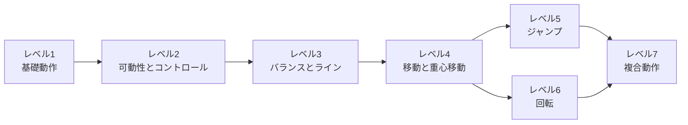
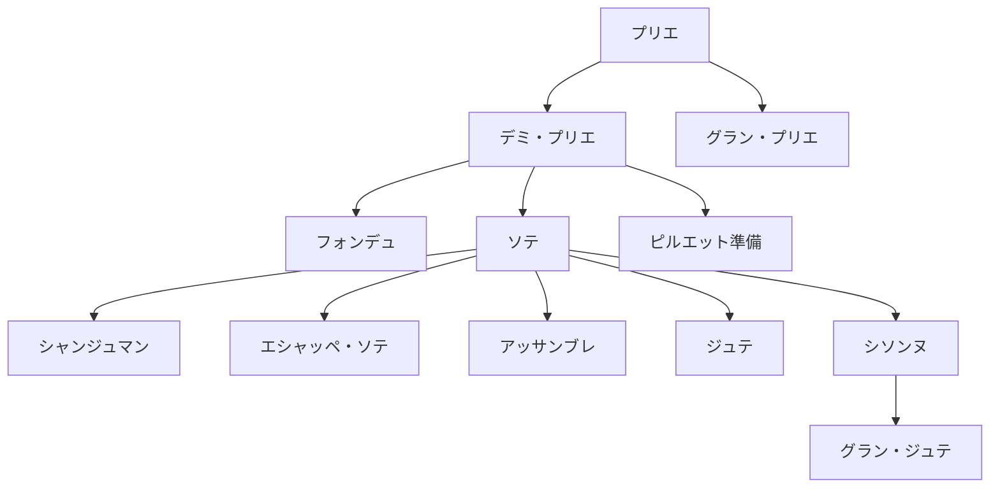
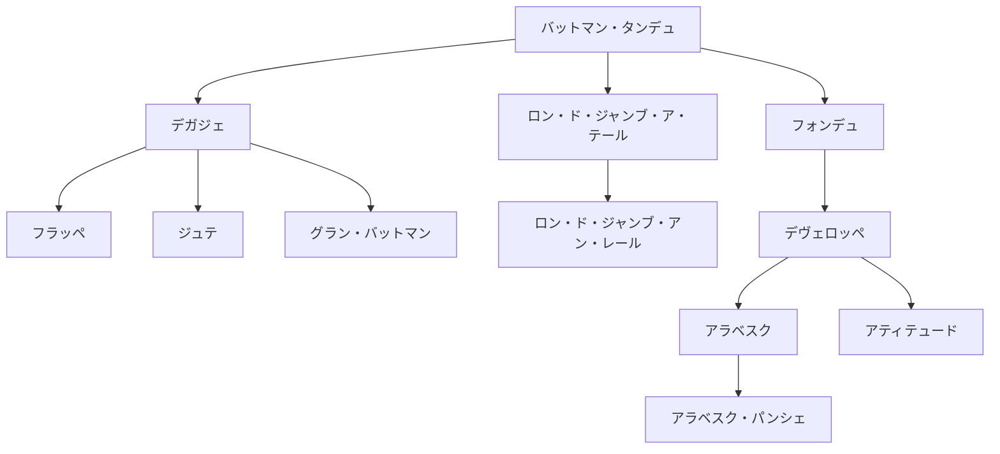
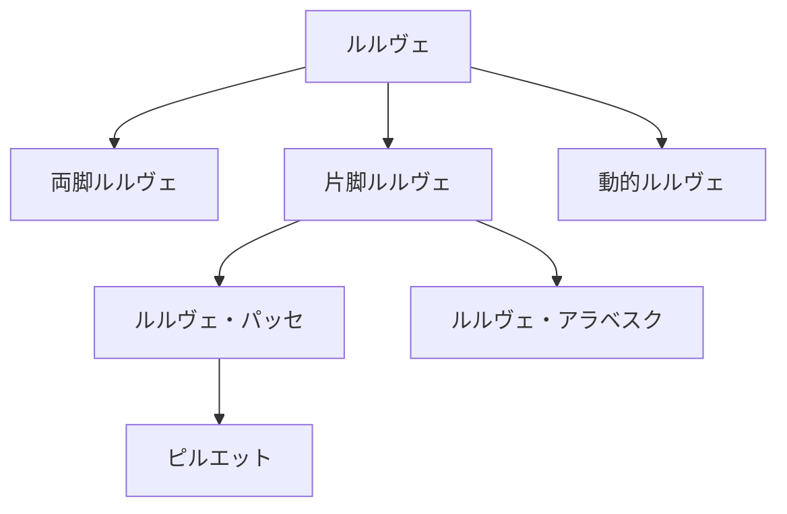
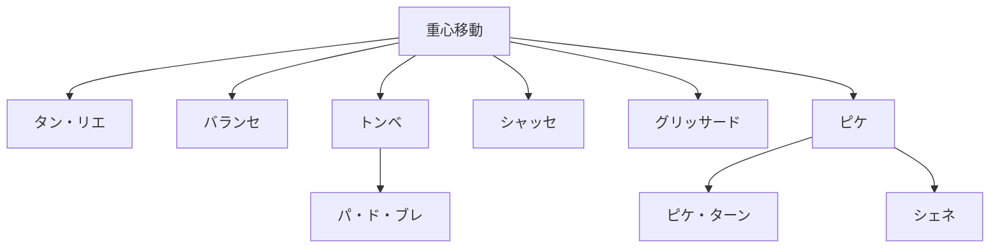
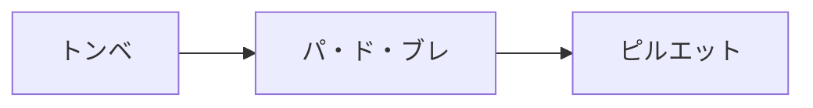

# BDX バレエ動作体系 v1.2

> BDX MOVE制作のための、動作選択・難易度調整・組み合わせツール

> **文書の位置づけ：専門監修前ドラフト**<br>
> BDXプロダクト設計者と鈴ちゃんが、MOVEコンテンツ制作時に共同で使用する内部実務資料である。一般ユーザー向けのバレエ教材ではない。

> **重要な前提**<br>
> 本資料は特定流派の教授法を再現するものではなく、BDXが一般ユーザー向け身体づくりへバレエ動作を応用するための制作上の整理である。ワガノワ、RAD、チェケッティ、フランス派等では用語や教授法に違いがあるため、複数の呼び方がある場合は日本国内で理解しやすいカタカナ表記をBDX上の正本として採用する。

---

## 1. BDXにおけるバレエ動作の考え方

BDXでは、バレエを「難しい技を習得するためのもの」としてだけ扱わない。バレエの世界で培われてきた姿勢、支持、重心移動、バランス、跳躍、回転、協調といった身体操作を、一般ユーザーの日常的な身体づくりに応用できる形へ翻訳する。

高度な動作を一律に排除するのではなく、同じ動作を次の変数で段階化する。

- 可動域
- 支持方法
- 支持面
- 速度
- 反復回数
- 衝撃
- 複雑性
- 移動の有無
- 腕、頭、視線の追加

たとえば、デミ・プリエは単独で終わる動作ではない。

```text
デミ・プリエ
    ↓
デミ・プリエ＋ポール・ド・ブラ
    ↓
デミ・プリエ＋ルルヴェ
    ↓
ソテ
    ↓
ジャンプ動作への発展
```

この考え方により、一般ユーザー向けの小さな動作と、経験者向けの発展動作を同じ体系の中で扱う。

### BDXの立場

- バレエの伝統や文化を尊重する。
- 特定流派の教授順序を唯一の正解とはしない。
- 目的名だけで動作を直接決めない。
- 高難度動作を一般ユーザー向けMOVEへ無条件に採用しない。
- 医学的な診断、治療、効果保証を行わない。
- 身体科学上の確認と、バレエ技術上の専門監修を分ける。

---

## 2. BDXバレエ動作体系 全体図



| レベル | 動作 | 役割 | 取得する内容 |
|---:|---|---|---|
| 1 | 基礎動作 | すべての土台 | 姿勢、支持、脚と腕の基本操作 |
| 2 | 可動性とコントロール | 動きながら軸を保つ | 動脚と支持側を分けて扱う力 |
| 3 | バランスとライン | 身体ラインをつくる | 片脚支持、姿勢保持、全身協調 |
| 4 | 移動と重心移動 | エクササイズから踊る動きへの橋渡し | 空間の中で身体を運ぶ力 |
| 5 | ジャンプ | 動的負荷を扱う | 床を押す、空中へ移動する、着地する力 |
| 6 | 回転 | 片脚支持と方向転換を統合する | 軸を保ちながら方向を変える力 |
| 7 | 複合動作 | 動作を「文章」にする | 複数動作を連続させる力 |

> **7段階の読み方**<br>
> BDXの7段階は、ユーザーのバレエ習熟度やバレエ教育上の級を示すものではない。支持、可動性、筋力、バランス、協調性、衝撃、移動、回転、複雑性など、動作に要求される身体的・運動的条件を整理するための制作上の段階である。一般ユーザーがレベル1から順番にバレエ技術を習得することを要求するものではない。

> **レベル4の重要性**<br>
> レベル4は、プリエやバットマン・タンデュのような「その場のエクササイズ」から、身体を空間の中で運ぶ「踊る動き」へ移る橋渡しである。ジャンプや回転を始める前に、重心を移し、次の支持脚へ安全に乗り換える能力を扱う。

### 動作情報の読み方

各動作は、MOVE制作時に1か所で判断できるよう、基本情報と制作情報を1つのブロックにまとめて表示する。

- 「主に使う部位」は、その動作で主に関与・使用する身体部位を示す
- 「動きの特徴」は、その場／移動、支持方法、衝撃、バランス、協調性、ジャンプ、回転等を示す
- バランス要求・協調性要求の低／中／高は、制作時に候補を比較するための初期整理であり、科学的な測定値ではない
- 同じ動作ブロック内で、前提、初心者向け調整、組み合わせ・発展、安全上の注意まで確認する
- 動作名やレベルだけで難易度を固定せず、実施方法と組み合わせを含めて判断する

---

## 3. レベル1：基礎動作

身体の姿勢、支持、基本的な脚や腕の操作を身につける段階。

### 動作

#### デミ・プリエ

| 項目 | 内容 |
|---|---|
| 動作概要 | 両脚で支持し、姿勢を保ちながら膝と股関節を曲げ伸ばす |
| 主に使う部位 | 下半身、股関節、膝関節、足関節、体幹 |
| 動きの特徴 | その場／両脚／低衝撃／バランス要求：低／協調性要求：中 |
| 前提となる動作 | 安定した立位 |
| 初心者向け調整 | 浅い可動域、椅子やバーで支持 |
| 組み合わせ・発展 | フォンデュ、ルルヴェ、ソテ |
| 安全上の注意 | 膝と足先の方向を無理なくそろえ、痛みのない範囲にする |

#### グラン・プリエ

| 項目 | 内容 |
|---|---|
| 動作概要 | より大きな可動域で沈み、立位へ戻る |
| 主に使う部位 | 下半身、股関節、膝関節、足関節、体幹 |
| 動きの特徴 | その場／両脚／低衝撃／バランス要求：中／協調性要求：中 |
| 前提となる動作 | デミ・プリエ |
| 初心者向け調整 | 可動域を小さくし、支持を使う |
| 組み合わせ・発展 | 深い重心移動、アダージオ |
| 安全上の注意 | 深さを目的にせず、姿勢と足部支持が崩れる前に止める |

#### バットマン・タンデュ

| 項目 | 内容 |
|---|---|
| 動作概要 | 支持脚を保ち、足先を床から離さず一方向へ伸ばして戻す |
| 主に使う部位 | 下半身、股関節、足関節、足部、体幹 |
| 動きの特徴 | その場／片脚中心／低衝撃／バランス要求：中／協調性要求：中 |
| 前提となる動作 | 安定した立位 |
| 初心者向け調整 | 小さい可動域、支持あり |
| 組み合わせ・発展 | デガジェ、ロン・ド・ジャンブ・ア・テール |
| 安全上の注意 | 股関節の外向きを足先だけで強制しない |

#### デガジェ

| 項目 | 内容 |
|---|---|
| 動作概要 | バットマン・タンデュから足先を床面より離して素早く出し戻す |
| 主に使う部位 | 下半身、股関節、足関節、体幹 |
| 動きの特徴 | その場／片脚中心／低衝撃／バランス要求：中／協調性要求：中 |
| 前提となる動作 | バットマン・タンデュ |
| 初心者向け調整 | 足を低く、ゆっくり行う |
| 組み合わせ・発展 | フラッペ、ジュテ、グラン・バットマン |
| 安全上の注意 | 支持脚と骨盤の安定を優先し、反動を小さくする |

#### ルルヴェ

| 項目 | 内容 |
|---|---|
| 動作概要 | 足裏全体の支持から踵を上げ、軸を保って戻す |
| 主に使う部位 | 下半身、足関節、足部、ふくらはぎ、体幹 |
| 動きの特徴 | その場／両脚または片脚／低衝撃／バランス要求：中／協調性要求：中 |
| 前提となる動作 | 安定した足部支持、デミ・プリエ |
| 初心者向け調整 | 両脚、低い高さ、支持あり |
| 組み合わせ・発展 | 片脚ルルヴェ、ルルヴェ・パッセ、回転準備 |
| 安全上の注意 | 足部が不安定な時は高さや反復を減らす |

#### ポール・ド・ブラ

| 項目 | 内容 |
|---|---|
| 動作概要 | 姿勢と呼吸を保ちながら腕を滑らかに運ぶ |
| 主に使う部位 | 上半身、肩周辺、腕、体幹 |
| 動きの特徴 | その場／両脚／低衝撃／バランス要求：低／協調性要求：中 |
| 前提となる動作 | 安定した姿勢 |
| 初心者向け調整 | 腕だけを小さく動かす |
| 組み合わせ・発展 | プリエとの組み合わせ、エポールマン |
| 安全上の注意 | 肩を過度に上げず、呼吸が止まらない範囲にする |

#### カンブレ

| 項目 | 内容 |
|---|---|
| 動作概要 | 軸を失わない範囲で上体を前後または側方へ動かす |
| 主に使う部位 | 体幹、上半身、股関節 |
| 動きの特徴 | その場／両脚／低衝撃／バランス要求：中／協調性要求：中 |
| 前提となる動作 | 安定した姿勢、体幹保持 |
| 初心者向け調整 | 小さい可動域、前方と側方から始める |
| 組み合わせ・発展 | アラベスク、アラベスク・パンシェ |
| 安全上の注意 | 腰部だけで反らず、違和感があれば可動域を減らす |

#### エポールマン

| 項目 | 内容 |
|---|---|
| 動作概要 | 肩、頭、視線と身体の方向を協調させる |
| 主に使う部位 | 上半身、肩周辺、首周辺、体幹 |
| 動きの特徴 | その場／両脚または片脚／低衝撃／バランス要求：中／協調性要求：高 |
| 前提となる動作 | ポール・ド・ブラ、姿勢保持 |
| 初心者向け調整 | 頭と視線だけを追加する |
| 組み合わせ・発展 | アダージオ、アンシェヌマン |
| 安全上の注意 | 首を急に動かさず、方向変化を段階的に追加する |
---

## 4. レベル2：可動性とコントロール

片脚を動かしながら、骨盤、体幹、支持脚を安定させる能力を高める段階。

### 動作

#### ロン・ド・ジャンブ・ア・テール

| 項目 | 内容 |
|---|---|
| 動作概要 | 足先で床上に弧を描き、股関節から脚の方向を変える |
| 主に使う部位 | 下半身、股関節、足関節、体幹 |
| 動きの特徴 | その場／片脚中心／低衝撃／バランス要求：中／協調性要求：中 |
| 前提となる動作 | バットマン・タンデュ |
| 初心者向け調整 | 小さい弧、支持あり |
| 組み合わせ・発展 | ロン・ド・ジャンブ・アン・レール |
| 安全上の注意 | 骨盤を無理に固定せず、股関節の快適な範囲で行う |

#### フォンデュ

| 項目 | 内容 |
|---|---|
| 動作概要 | 支持脚と動脚を協調させて曲げ、伸ばす |
| 主に使う部位 | 下半身、股関節、膝関節、足関節、体幹 |
| 動きの特徴 | その場／片脚中心／低衝撃／バランス要求：高／協調性要求：高 |
| 前提となる動作 | デミ・プリエ、バットマン・タンデュ |
| 初心者向け調整 | 両手支持、動脚を低くする |
| 組み合わせ・発展 | デヴェロッペ、アダージオ |
| 安全上の注意 | 支持脚の膝と足先の方向、軸の安定を優先する |

#### フラッペ

| 項目 | 内容 |
|---|---|
| 動作概要 | 動脚を素早く伸ばし、明確に出し戻す |
| 主に使う部位 | 下半身、股関節、足関節、足部、体幹 |
| 動きの特徴 | その場／片脚中心／低衝撃／バランス要求：中／協調性要求：高 |
| 前提となる動作 | デガジェ |
| 初心者向け調整 | 低い位置、ゆっくりした出し戻し |
| 組み合わせ・発展 | プティ・アレグロ、ジュテ |
| 安全上の注意 | 速度より制御を優先し、足部を強く打ちつけない |

#### プティ・バットマン

| 項目 | 内容 |
|---|---|
| 動作概要 | 膝の位置を保ち、下腿を細かく切り替える |
| 主に使う部位 | 下半身、股関節、膝関節、足関節、体幹 |
| 動きの特徴 | その場／片脚中心／低衝撃／バランス要求：高／協調性要求：高 |
| 前提となる動作 | フラッペ、片脚支持 |
| 初心者向け調整 | 支持あり、速度を下げる |
| 組み合わせ・発展 | プティ・アレグロ |
| 安全上の注意 | 膝と骨盤が揺れる場合は範囲と速度を下げる |

#### パッセ

| 項目 | 内容 |
|---|---|
| 動作概要 | 片脚を支持脚の近くに通過させて運ぶ |
| 主に使う部位 | 下半身、股関節、膝関節、体幹 |
| 動きの特徴 | その場／片脚中心／低衝撃／バランス要求：中／協調性要求：中 |
| 前提となる動作 | バットマン・タンデュ |
| 初心者向け調整 | 足先を低い位置で通過させる |
| 組み合わせ・発展 | ルティレ、重心移動 |
| 安全上の注意 | 支持脚を安定させ、動脚を無理に外へ開かない |

#### ルティレ

| 項目 | 内容 |
|---|---|
| 動作概要 | 片脚を支持脚の膝付近に保持する |
| 主に使う部位 | 下半身、股関節、膝関節、体幹 |
| 動きの特徴 | その場／片脚／低衝撃／バランス要求：高／協調性要求：高 |
| 前提となる動作 | パッセ、片脚支持 |
| 初心者向け調整 | つま先を低くし、支持を使う |
| 組み合わせ・発展 | ルルヴェ・パッセ、ピルエット準備 |
| 安全上の注意 | バランスが不安定な場合は支持を外さない |

#### デヴェロッペ

| 項目 | 内容 |
|---|---|
| 動作概要 | 曲げた動脚をコントロールしながら一方向へ伸ばす |
| 主に使う部位 | 下半身、股関節、体幹 |
| 動きの特徴 | その場／片脚／低衝撃／バランス要求：高／協調性要求：高 |
| 前提となる動作 | フォンデュ、ルティレ |
| 初心者向け調整 | 脚を低く保ち、伸ばし切らない |
| 組み合わせ・発展 | アラベスク、アティテュード |
| 安全上の注意 | 脚の高さより骨盤と体幹の制御を優先する |

#### グラン・バットマン

| 項目 | 内容 |
|---|---|
| 動作概要 | 動脚を大きく振り上げ、制御して戻す |
| 主に使う部位 | 下半身、股関節、体幹 |
| 動きの特徴 | その場／片脚中心／中衝撃／バランス要求：高／協調性要求：高 |
| 前提となる動作 | デガジェ、体幹保持 |
| 初心者向け調整 | 脚の高さと速度を下げる |
| 組み合わせ・発展 | グラン・アレグロ、グラン・ジュテ準備 |
| 安全上の注意 | 反動と支持脚の崩れを抑え、疲労時は高さを下げる |

#### ロン・ド・ジャンブ・アン・レール

| 項目 | 内容 |
|---|---|
| 動作概要 | 動脚を空中に保ち、下腿または脚で弧を描く |
| 主に使う部位 | 下半身、股関節、膝関節、体幹 |
| 動きの特徴 | その場／片脚／低衝撃／バランス要求：高／協調性要求：高 |
| 前提となる動作 | ロン・ド・ジャンブ・ア・テール、片脚支持 |
| 初心者向け調整 | 動脚を低くし、支持を使う |
| 組み合わせ・発展 | アダージオ、回転系 |
| 安全上の注意 | 股関節と体幹の制御が崩れる前に範囲を縮小する |

#### ロン・ド・ジャンブ・ジュテ

| 項目 | 内容 |
|---|---|
| 動作概要 | 脚を投げ出すような動きと弧の方向変化を組み合わせる |
| 主に使う部位 | 下半身、股関節、足関節、体幹 |
| 動きの特徴 | その場／片脚中心／中衝撃／バランス要求：高／協調性要求：高 |
| 前提となる動作 | デガジェ、ロン・ド・ジャンブ・ア・テール |
| 初心者向け調整 | 小さな軌道、低速 |
| 組み合わせ・発展 | 大きな脚の軌道を含む複合動作 |
| 安全上の注意 | 勢いだけで動かさず、周囲の空間を確保する |
---

## 5. レベル3：バランスとライン

片脚支持、姿勢保持、脚と体幹の協調によって、バレエ特有の身体ラインをつくる段階。

### 動作

#### アラベスク

| 項目 | 内容 |
|---|---|
| 動作概要 | 片脚支持で反対脚を後方へ伸ばし、全身のラインを保つ |
| 主に使う部位 | 下半身、股関節、体幹、上半身 |
| 動きの特徴 | その場／片脚／低衝撃／バランス要求：高／協調性要求：高 |
| 前提となる動作 | バットマン・タンデュ、デヴェロッペ |
| 初心者向け調整 | 動脚を低くし、支持を使う |
| 組み合わせ・発展 | ルルヴェ・アラベスク、アラベスク・パンシェ |
| 安全上の注意 | 高さより支持脚、骨盤、体幹の安定を優先する |

#### アティテュード

| 項目 | 内容 |
|---|---|
| 動作概要 | 片脚支持で動脚を曲げた形に保ち、姿勢を維持する |
| 主に使う部位 | 下半身、股関節、体幹、上半身 |
| 動きの特徴 | その場／片脚／低衝撃／バランス要求：高／協調性要求：高 |
| 前提となる動作 | デヴェロッペ、片脚支持 |
| 初心者向け調整 | 動脚を低くし、両手支持 |
| 組み合わせ・発展 | アティテュード・ターン |
| 安全上の注意 | 形を強制せず、腰部や支持側へ過度に偏らない |

#### アラベスク・パンシェ

| 項目 | 内容 |
|---|---|
| 動作概要 | アラベスクから上体と動脚のラインを傾ける |
| 主に使う部位 | 下半身、股関節、体幹、上半身 |
| 動きの特徴 | その場／片脚／低衝撃／バランス要求：高／協調性要求：高 |
| 前提となる動作 | 安定したアラベスク |
| 初心者向け調整 | 小さい傾斜、支持あり |
| 組み合わせ・発展 | 経験者向けアダージオ |
| 安全上の注意 | 支持なしで急に深く傾けず、周囲と足元を確認する |

#### ルルヴェ・パッセ

| 項目 | 内容 |
|---|---|
| 動作概要 | ルルヴェ上で片脚をパッセまたはルティレの位置に保つ |
| 主に使う部位 | 下半身、股関節、足関節、足部、体幹 |
| 動きの特徴 | その場／片脚／低衝撃／バランス要求：高／協調性要求：高 |
| 前提となる動作 | ルルヴェ、ルティレ |
| 初心者向け調整 | 両脚ルルヴェ、低いパッセ、支持あり |
| 組み合わせ・発展 | ピルエット・アン・ドゥオール、ピルエット・アン・ドゥダン |
| 安全上の注意 | 足部とバランスが崩れる場合は両脚支持へ戻す |

#### ルルヴェ・アラベスク

| 項目 | 内容 |
|---|---|
| 動作概要 | ルルヴェ上でアラベスクのラインを保つ |
| 主に使う部位 | 下半身、股関節、足関節、足部、体幹 |
| 動きの特徴 | その場／片脚／低衝撃／バランス要求：高／協調性要求：高 |
| 前提となる動作 | ルルヴェ、アラベスク |
| 初心者向け調整 | 踵を低くし、支持あり |
| 組み合わせ・発展 | アダージオ、複合バランス |
| 安全上の注意 | 脚の高さと踵の高さを同時に上げすぎない |

#### デヴェロッペ・ア・ラ・スゴンド

| 項目 | 内容 |
|---|---|
| 動作概要 | デヴェロッペで動脚を側方へ伸ばし保持する |
| 主に使う部位 | 下半身、股関節、体幹、上半身 |
| 動きの特徴 | その場／片脚／低衝撃／バランス要求：高／協調性要求：高 |
| 前提となる動作 | デヴェロッペ、片脚支持 |
| 初心者向け調整 | 低い高さ、支持あり |
| 組み合わせ・発展 | アダージオ、方向変化を伴う複合動作 |
| 安全上の注意 | 股関節の範囲を超えて脚を横へ上げない |
---

## 6. レベル4：移動と重心移動

その場で行う動作から、空間の中で身体を移動させる動作へ発展する段階。BDXでは、「エクササイズ」から「踊る動き」へ移行する重要な段階として独立させる。

### 動作

#### タン・リエ

| 項目 | 内容 |
|---|---|
| 動作概要 | 脚を伸ばす動作と体重移動をつなぎ、支持脚を乗り換える |
| 主に使う部位 | 下半身、股関節、膝関節、足関節、体幹 |
| 動きの特徴 | 移動／支持切替／低衝撃／バランス要求：中／協調性要求：高 |
| 前提となる動作 | バットマン・タンデュ、デミ・プリエ |
| 初心者向け調整 | 歩幅を小さくし、支持あり |
| 組み合わせ・発展 | トンベ、バランセ、アダージオ |
| 安全上の注意 | 重心を急に移さず、床面と足元を確認する |

#### トンベ

| 項目 | 内容 |
|---|---|
| 動作概要 | 一方向へ重心を落とし、新しい支持脚へ移る |
| 主に使う部位 | 下半身、股関節、膝関節、足関節、体幹 |
| 動きの特徴 | 移動／片脚から片脚／低〜中衝撃／バランス要求：中／協調性要求：高 |
| 前提となる動作 | タン・リエ、デミ・プリエ |
| 初心者向け調整 | 小さい歩幅、停止を入れる |
| 組み合わせ・発展 | パ・ド・ブレ、ピルエット準備 |
| 安全上の注意 | 膝と足先の方向を保ち、勢いで深く沈まない |

#### パ・ド・ブレ

| 項目 | 内容 |
|---|---|
| 動作概要 | 小さなステップを連続し、重心と方向を移す |
| 主に使う部位 | 下半身、足関節、足部、体幹 |
| 動きの特徴 | 移動／支持切替／低衝撃／バランス要求：中／協調性要求：高 |
| 前提となる動作 | 小さな重心移動 |
| 初心者向け調整 | ゆっくり分解し、一歩ごとに止まる |
| 組み合わせ・発展 | ピルエット、アンシェヌマン |
| 安全上の注意 | 足が交差する場面では速度を下げ、空間を確保する |

#### シャッセ

| 項目 | 内容 |
|---|---|
| 動作概要 | 一方の脚が他方を追うように移動する |
| 主に使う部位 | 下半身、股関節、膝関節、足関節、体幹 |
| 動きの特徴 | 移動／支持切替／低〜中衝撃／小さな浮き／バランス要求：中／協調性要求：高 |
| 前提となる動作 | タン・リエ、支持切替 |
| 初心者向け調整 | 跳ばずに滑るように移動する |
| 組み合わせ・発展 | グリッサード、グラン・ジュテ準備 |
| 安全上の注意 | 床の滑りやすさを確認し、歩幅を調整する |

#### バランセ

| 項目 | 内容 |
|---|---|
| 動作概要 | 左右または前後へ揺れるように重心を移す |
| 主に使う部位 | 下半身、股関節、足関節、体幹、上半身 |
| 動きの特徴 | 移動／支持切替／低衝撃／バランス要求：中／協調性要求：高 |
| 前提となる動作 | タン・リエ、ポール・ド・ブラ |
| 初心者向け調整 | 脚だけ、狭い幅で行う |
| 組み合わせ・発展 | アンシェヌマン、表現を伴う移動 |
| 安全上の注意 | 上体の傾きと重心移動を同時に大きくしすぎない |

#### グリッサード

| 項目 | 内容 |
|---|---|
| 動作概要 | 床を滑るように脚を開閉して移動する |
| 主に使う部位 | 下半身、股関節、膝関節、足関節、体幹 |
| 動きの特徴 | 移動／支持切替／中衝撃／小ジャンプ／バランス要求：高／協調性要求：高 |
| 前提となる動作 | シャッセ、ソテ、着地能力 |
| 初心者向け調整 | 跳ばずに脚の開閉を練習する |
| 組み合わせ・発展 | アッサンブレ、ジュテ |
| 安全上の注意 | 着地の安定、床面、疲労を確認する |

#### ピケ

| 項目 | 内容 |
|---|---|
| 動作概要 | 伸ばした脚へ踏み込み、明確に重心を乗せる |
| 主に使う部位 | 下半身、足関節、足部、体幹 |
| 動きの特徴 | 移動／片脚／低〜中衝撃／バランス要求：高／協調性要求：高 |
| 前提となる動作 | タン・リエ、片脚支持 |
| 初心者向け調整 | 低いルルヴェ、支持あり |
| 組み合わせ・発展 | ピケ・ターン、シェネ |
| 安全上の注意 | 踏み込みの強さと足部の安定を調整する |

#### パ・ド・バスク

| 項目 | 内容 |
|---|---|
| 動作概要 | 方向と支持脚を変えながら弧を描くように移動する |
| 主に使う部位 | 下半身、股関節、足関節、体幹、上半身 |
| 動きの特徴 | 移動／支持切替／中衝撃／方向転換あり／小さな浮き／バランス要求：高／協調性要求：高 |
| 前提となる動作 | タン・リエ、バランセ、方向転換 |
| 初心者向け調整 | 分解して歩き、回転を伴わせない |
| 組み合わせ・発展 | 複合移動、アレグロ |
| 安全上の注意 | 方向転換を急がず、十分な空間を確保する |
---

## 7. レベル5：ジャンプ

床を押す、空中へ移動する、着地するという一連の能力を扱う段階。ジャンプは動作名だけでなく、着地能力、下肢への衝撃、疲労、運動習慣、バレエ経験、バランス能力を踏まえて提供する。

### 動作

#### ソテ

| 項目 | 内容 |
|---|---|
| 動作概要 | 両脚または片脚で床を押し、同じ支持構造へ着地する |
| 主に使う部位 | 下半身、股関節、膝関節、足関節、体幹 |
| 動きの特徴 | その場／両脚または片脚／中衝撃／ジャンプあり／バランス要求：中／協調性要求：高 |
| 前提となる動作 | デミ・プリエ、ルルヴェ、着地練習 |
| 初心者向け調整 | 踵を少し上げる、跳ばずに床を押す |
| 組み合わせ・発展 | シャンジュマン、エシャッペ・ソテ |
| 安全上の注意 | 着地、床面、疲労、運動習慣を確認し、反復を調整する |

#### シャンジュマン

| 項目 | 内容 |
|---|---|
| 動作概要 | 跳躍中に脚の前後関係を入れ替えて着地する |
| 主に使う部位 | 下半身、股関節、膝関節、足関節、体幹 |
| 動きの特徴 | その場／両脚／中衝撃／ジャンプあり／バランス要求：高／協調性要求：高 |
| 前提となる動作 | 安定したソテ |
| 初心者向け調整 | 脚の入れ替えを床上で練習する |
| 組み合わせ・発展 | プティ・アレグロ |
| 安全上の注意 | 着地時の脚位とバランスが崩れる場合はソテへ戻す |

#### エシャッペ・ソテ

| 項目 | 内容 |
|---|---|
| 動作概要 | 閉じた脚位から跳び、開いた脚位へ移って戻る |
| 主に使う部位 | 下半身、股関節、膝関節、足関節、体幹 |
| 動きの特徴 | その場／両脚／中衝撃／ジャンプあり／バランス要求：高／協調性要求：高 |
| 前提となる動作 | ソテ、脚位の開閉 |
| 初心者向け調整 | 跳ばずに開閉し、可動域を小さくする |
| 組み合わせ・発展 | プティ・アレグロ |
| 安全上の注意 | 脚位を無理に広げず、着地の衝撃を管理する |

#### アッサンブレ

| 項目 | 内容 |
|---|---|
| 動作概要 | 一方の脚から跳び、空中で脚を集めて両脚で着地する |
| 主に使う部位 | 下半身、股関節、膝関節、足関節、体幹 |
| 動きの特徴 | 移動／片脚から両脚／中〜高衝撃／ジャンプあり／バランス要求：高／協調性要求：高 |
| 前提となる動作 | デガジェ、グリッサード、ソテ |
| 初心者向け調整 | 跳ばずに脚を集める順序を練習する |
| 組み合わせ・発展 | プティ・アレグロ |
| 安全上の注意 | 片脚からの踏切と両脚着地を段階的に確認する |

#### ジュテ

| 項目 | 内容 |
|---|---|
| 動作概要 | 一方の脚から他方の脚へ跳び移る |
| 主に使う部位 | 下半身、股関節、膝関節、足関節、体幹 |
| 動きの特徴 | 移動／片脚から片脚／中〜高衝撃／ジャンプあり／バランス要求：高／協調性要求：高 |
| 前提となる動作 | デガジェ、ソテ、重心移動 |
| 初心者向け調整 | 小さな左右移動、跳ばずに支持を切り替える |
| 組み合わせ・発展 | シソンヌ、プティ・アレグロ |
| 安全上の注意 | 片脚着地の安定が不足する場合は移動量を下げる |

#### シソンヌ

| 項目 | 内容 |
|---|---|
| 動作概要 | 両脚から跳び、主に片脚へ着地する |
| 主に使う部位 | 下半身、股関節、膝関節、足関節、体幹 |
| 動きの特徴 | 移動／両脚から片脚／高衝撃／ジャンプあり／バランス要求：高／協調性要求：高 |
| 前提となる動作 | ソテ、ジュテ、片脚着地 |
| 初心者向け調整 | 両脚着地または小さな跳躍に変える |
| 組み合わせ・発展 | グラン・ジュテ、グラン・アレグロ |
| 安全上の注意 | 片脚着地、疲労、衝撃を確認し、経験者を中心に扱う |

#### パ・ド・シャ

| 項目 | 内容 |
|---|---|
| 動作概要 | 脚を順に引き上げながら空中を移動する |
| 主に使う部位 | 下半身、股関節、膝関節、足関節、体幹 |
| 動きの特徴 | 移動／片脚から片脚／高衝撃／ジャンプあり／バランス要求：高／協調性要求：高 |
| 前提となる動作 | ジュテ、パッセ、片脚着地 |
| 初心者向け調整 | 跳ばずにパッセの切替を練習する |
| 組み合わせ・発展 | グラン・アレグロ |
| 安全上の注意 | 高さより順序と着地を優先し、一般ユーザーへ無条件に推薦しない |

#### アントルシャ・カトル

| 項目 | 内容 |
|---|---|
| 動作概要 | 空中で脚を素早く交差させ、両脚で着地する |
| 主に使う部位 | 下半身、股関節、膝関節、足関節、体幹 |
| 動きの特徴 | その場／両脚／高衝撃／ジャンプあり／バランス要求：高／協調性要求：高 |
| 前提となる動作 | シャンジュマン、高速の脚操作 |
| 初心者向け調整 | 打ち合わせずに小さなシャンジュマン |
| 組み合わせ・発展 | 高度なプティ・アレグロ |
| 安全上の注意 | 高速反復と衝撃が大きいため、経験と状態を確認する |

#### ブリゼ

| 項目 | 内容 |
|---|---|
| 動作概要 | 移動する跳躍の中で脚を打ち合わせる |
| 主に使う部位 | 全身、下半身、股関節、膝関節、足関節、体幹 |
| 動きの特徴 | 移動／片脚から片脚／高衝撃／方向転換あり／ジャンプあり／バランス要求：高／協調性要求：高 |
| 前提となる動作 | アッサンブレ、ジュテ、脚の打ち合わせ |
| 初心者向け調整 | 跳ばずに方向と脚順を分解する |
| 組み合わせ・発展 | 高度なアレグロ |
| 安全上の注意 | 十分な空間と着地能力を前提とし、専門監修下で扱う |

#### グラン・ジュテ

| 項目 | 内容 |
|---|---|
| 動作概要 | 大きく空間を移動し、一方の脚から他方へ跳ぶ |
| 主に使う部位 | 全身、下半身、股関節、膝関節、足関節、体幹 |
| 動きの特徴 | 移動／片脚から片脚／高衝撃／ジャンプあり／バランス要求：高／協調性要求：高 |
| 前提となる動作 | シャッセ、シソンヌ、グラン・バットマン |
| 初心者向け調整 | 歩幅を小さくし、跳ばずに脚を運ぶ |
| 組み合わせ・発展 | グラン・アレグロ、マネージュ |
| 安全上の注意 | 衝撃と移動量が大きいため、経験、床面、疲労を確認する |
### ジャンプ採用前の確認

- 安定して着地できるか
- 下肢への衝撃を受け止められる状態か
- 疲労が高くないか
- 継続的な運動習慣があるか
- バレエ経験とジャンプ経験があるか
- 片脚または両脚でのバランスを保てるか
- 十分な床面と周囲の空間があるか

---

## 8. レベル6：回転

片脚支持や連続的な重心移動を伴いながら、身体の方向を変える能力を扱う段階。一般ユーザー向けの方向転換と、バレエ経験者向けの高度な回転を区別する。

### 動作

#### ストゥニュー・ターン

| 項目 | 内容 |
|---|---|
| 動作概要 | 両脚をまとめる動きと方向転換を連続させる |
| 主に使う部位 | 下半身、足関節、足部、体幹、上半身 |
| 動きの特徴 | 移動／両脚中心／低衝撃／回転あり／バランス要求：高／協調性要求：高 |
| 前提となる動作 | パ・ド・ブレ、両脚ルルヴェ |
| 初心者向け調整 | 踵を低くし、半回転から始める |
| 組み合わせ・発展 | シェネ、アンシェヌマン |
| 安全上の注意 | 目まい、足元、周囲の空間を確認し、回転数を抑える |

#### シェネ

| 項目 | 内容 |
|---|---|
| 動作概要 | 小さなステップを連続しながら回転して移動する |
| 主に使う部位 | 全身、下半身、足関節、足部、体幹 |
| 動きの特徴 | 移動／支持切替／低〜中衝撃／連続回転／バランス要求：高／協調性要求：高 |
| 前提となる動作 | ピケ、ストゥニュー・ターン |
| 初心者向け調整 | 歩いて半回転ずつ進む |
| 組み合わせ・発展 | マネージュ、連続回転 |
| 安全上の注意 | 十分な直線空間を確保し、速度と回数を段階化する |

#### ピケ・ターン

| 項目 | 内容 |
|---|---|
| 動作概要 | 伸ばした脚へ踏み込み、片脚支持で回転する |
| 主に使う部位 | 下半身、股関節、足関節、足部、体幹 |
| 動きの特徴 | 移動／片脚／低〜中衝撃／回転あり／バランス要求：高／協調性要求：高 |
| 前提となる動作 | ピケ、ルルヴェ・パッセ |
| 初心者向け調整 | 支持ありでピケから止まる |
| 組み合わせ・発展 | シェネ、マネージュ |
| 安全上の注意 | 足部支持と方向確認を優先し、回転を急がない |

#### ピルエット・アン・ドゥオール

| 項目 | 内容 |
|---|---|
| 動作概要 | 片脚支持で身体を外方向へ回転させる |
| 主に使う部位 | 全身、下半身、股関節、足関節、体幹 |
| 動きの特徴 | その場／片脚／低衝撃／回転あり／バランス要求：高／協調性要求：高 |
| 前提となる動作 | ルルヴェ・パッセ、トンベ、パ・ド・ブレ |
| 初心者向け調整 | 四分の一回転、支持あり |
| 組み合わせ・発展 | 複合回転、アンシェヌマン |
| 安全上の注意 | 軸が保てない場合は回転量を減らし、準備動作へ戻す |

#### ピルエット・アン・ドゥダン

| 項目 | 内容 |
|---|---|
| 動作概要 | 片脚支持で身体を内方向へ回転させる |
| 主に使う部位 | 全身、下半身、股関節、足関節、体幹 |
| 動きの特徴 | その場／片脚／低衝撃／回転あり／バランス要求：高／協調性要求：高 |
| 前提となる動作 | ルルヴェ・パッセ、重心移動 |
| 初心者向け調整 | 四分の一回転、支持あり |
| 組み合わせ・発展 | 複合回転、アンシェヌマン |
| 安全上の注意 | 方向理解と支持脚の安定を確認し、無理に回り切らない |

#### アティテュード・ターン

| 項目 | 内容 |
|---|---|
| 動作概要 | アティテュードの形を保ちながら片脚で回転する |
| 主に使う部位 | 全身、下半身、股関節、足関節、体幹 |
| 動きの特徴 | その場・移動／片脚／低衝撃／回転あり／バランス要求：高／協調性要求：高 |
| 前提となる動作 | アティテュード、安定したピルエット |
| 初心者向け調整 | 回転なしのアティテュード保持 |
| 組み合わせ・発展 | 高度なアンシェヌマン |
| 安全上の注意 | バレエ経験者向けとし、専門監修下で発展させる |

#### フェッテ

| 項目 | 内容 |
|---|---|
| 動作概要 | 動脚の運動と支持脚の回転を連続させる |
| 主に使う部位 | 全身、下半身、股関節、膝関節、足関節、体幹 |
| 動きの特徴 | その場／片脚／中衝撃／連続回転／バランス要求：高／協調性要求：高 |
| 前提となる動作 | 安定した連続回転、デヴェロッペ・ア・ラ・スゴンド |
| 初心者向け調整 | 回転なしで動脚と支持脚を分解する |
| 組み合わせ・発展 | 高度な複合回転 |
| 安全上の注意 | 一般ユーザーへ積極推薦せず、経験、疲労、空間を確認する |
### 利用区分

| 利用対象 | 動作 | 条件 |
|---|---|---|
| 一般ユーザーへの段階的提供が可能 | ストゥニュー・ターン | 支持、低速、半回転などへ調整する |
| 運動能力・経験を確認して提供 | シェネ、ピケ・ターン、ピルエット・アン・ドゥオール、ピルエット・アン・ドゥダン | 前提動作、空間、バランス、疲労を確認する |
| 主にバレエ経験者へ提供 | アティテュード・ターン、フェッテ | 専門監修と十分な前提動作を必要とする |

---

## 9. レベル7：複合動作

複数のバレエ動作を連続させ、動きとして組み立てる最終段階。単独のバレエ動作を「単語」とするなら、複数の動作を組み合わせた複合動作は「文章」に相当する。

```text
トンベ
    ↓
パ・ド・ブレ
    ↓
ピルエット
```

### 動作

#### アダージオ

| 項目 | 内容 |
|---|---|
| 動作概要 | ゆっくりしたテンポで、姿勢、バランス、脚のコントロールを連結する |
| 主に使う部位 | 全身、下半身、上半身、股関節、体幹 |
| 動きの特徴 | その場・移動／支持切替／低衝撃／回転あり／バランス要求：高／協調性要求：高 |
| 前提となる動作 | レベル1〜3の姿勢、コントロール、バランス |
| 初心者向け調整 | 2動作だけを低い可動域で連結する |
| 組み合わせ・発展 | 長いアンシェヌマン |
| 安全上の注意 | 保持時間と可動域を調整し、疲労で姿勢が崩れる前に止める |

#### プティ・アレグロ

| 項目 | 内容 |
|---|---|
| 動作概要 | 小さく速いジャンプやステップを連続させる |
| 主に使う部位 | 全身、下半身、股関節、膝関節、足関節、体幹 |
| 動きの特徴 | 移動／支持切替／中〜高衝撃／回転あり／ジャンプあり／バランス要求：高／協調性要求：高 |
| 前提となる動作 | ソテ、シャンジュマン、アッサンブレなど |
| 初心者向け調整 | 跳ばずに足順を確認し、短い組み合わせにする |
| 組み合わせ・発展 | より複雑なアレグロ |
| 安全上の注意 | 反復数、衝撃、着地、疲労を管理する |

#### グラン・アレグロ

| 項目 | 内容 |
|---|---|
| 動作概要 | 大きな移動と跳躍を組み合わせる |
| 主に使う部位 | 全身、下半身、上半身、股関節、膝関節、足関節、体幹 |
| 動きの特徴 | 大きく移動／支持切替／高衝撃／回転あり／ジャンプあり／バランス要求：高／協調性要求：高 |
| 前提となる動作 | 移動、片脚着地、大きなジャンプ |
| 初心者向け調整 | 跳ばずに軌道だけを練習する |
| 組み合わせ・発展 | マネージュ |
| 安全上の注意 | 十分な経験、空間、床面、休息を前提とする |

#### アンシェヌマン

| 項目 | 内容 |
|---|---|
| 動作概要 | 目的に応じて複数の動作を一つの流れへ組み立てる |
| 主に使う部位 | 全身、下半身、上半身、股関節、足関節、体幹 |
| 動きの特徴 | その場・移動／支持切替／バランス要求：高／協調性要求：高 |
| 前提となる動作 | 採用する各動作の前提を満たすこと |
| 初心者向け調整 | 動作数を減らし、間に停止を入れる |
| 組み合わせ・発展 | 音楽、方向、表現を含む構成 |
| 安全上の注意 | 接続が不自然でないか、難易度が急変しないか確認する |

#### マネージュ

| 項目 | 内容 |
|---|---|
| 動作概要 | 円形の軌道などを使い、移動、跳躍、回転を連続させる |
| 主に使う部位 | 全身、下半身、上半身、股関節、膝関節、足関節、体幹 |
| 動きの特徴 | 大きく移動／支持切替／中〜高衝撃／回転あり／ジャンプあり／バランス要求：高／協調性要求：高 |
| 前提となる動作 | 回転、移動、ジャンプの十分な経験 |
| 初心者向け調整 | 歩行で円軌道を確認し、動作を一つに限定する |
| 組み合わせ・発展 | 舞台的な複合構成 |
| 安全上の注意 | 広い空間、方向感覚、疲労、衝撃を確認し、経験者を中心に扱う |
---

## 10. 動作発展図

以下はBDXにおけるコンテンツ設計上の発展関係であり、クラシックバレエ教育における唯一の正式な教授順序を示すものではない。図中の「プリエ」「重心移動」「両脚ルルヴェ」「片脚ルルヴェ」「動的ルルヴェ」「ピルエット準備」「ピルエット」は、ファミリーまたは設計上の中間ノードである。

### プリエ系



### タンデュ系



### ルルヴェ系



### 重心移動系



### 複合動作への代表的な接続



---

## 11. 初心者向け難易度調整

同じ動作でも、可動域、支持、速度、支持面、要素数、反復、衝撃等によって難易度は変わる。「プリエ＝初心者」「ルルヴェ＝中級」のように、動作名だけで難易度を固定しない。

| 調整軸 | やさしくする | 基本 | 難しくする |
|---|---|---|---|
| 可動域 | 小さくする | 無理のない通常範囲 | 大きくする |
| 支持 | 椅子・バーを両手で使う | 軽く支持する | 支持なし |
| 速度 | ゆっくり、途中で止める | 一定の速度 | 速くする、速度を変える |
| 支持面 | 両脚支持 | 支持切替 | 片脚支持、ルルヴェ |
| 腕 | 腕を省略・固定する | 簡単な腕を加える | 脚と異なる方向やタイミングで動かす |
| 頭・視線 | 正面に固定する | 一方向を加える | 方向変化を連続させる |
| 移動 | その場 | 小さく移動 | 複数方向、大きく移動 |
| 組み合わせ | 単独動作 | 2動作を接続 | 3動作以上を連続させる |
| 反復 | 少なくする | 基本回数 | 増やす、連続させる |
| 衝撃 | 跳ばない | 小さな浮き・踏み込み | ジャンプ、片脚着地 |
| 回転 | 回転なし | 方向転換、部分回転 | 完全回転、連続回転 |

### 難易度を下げる基本順序

~~~mermaid
flowchart LR
    A[可動域を小さくする] --> B[支持を追加する]
    B --> C[速度を下げる]
    C --> D[腕・頭・視線を減らす]
    D --> E[移動・組み合わせを減らす]
    E --> F[反復・衝撃・回転を下げる]
~~~

### 例：デミ・プリエからの発展

| 段階 | 実施方法 |
|---:|---|
| 1 | 椅子を使い、小さい可動域でデミ・プリエ |
| 2 | 軽い支持で通常の可動域へ近づける |
| 3 | 支持なしでデミ・プリエ |
| 4 | ポール・ド・ブラを追加する |
| 5 | ルルヴェまたは小さな重心移動を追加する |
| 6 | 着地能力と状態を確認してソテへ発展する |

### 調整または中止を判断するサイン

- 痛み、強い違和感、ふらつきがある
- 疲労で姿勢、支持、着地を保てない
- 前提となる動作を再現できない
- 床面、天井高、周囲の空間が動作に適さない
- 動作説明や代替方法を理解できていない

これらは医学的診断ではない。難易度を下げる、別の動作へ変える、または中止するための制作・運用上の判断材料である。

---

## 12. 身体部位・動きの特徴から探す

54動作を最初から順に読む代わりに、作りたい身体づくりの方向や動きの特徴から候補を探すための索引である。候補は既存の動作概要、使用部位、動きの特徴、発展関係を基に整理している。

| 探したい方向 | 関連動作候補 | 制作時の確認 |
|---|---|---|
| 下半身を使う | デミ・プリエ、バットマン・タンデュ、デガジェ、フォンデュ、ルルヴェ、タン・リエ、シャッセ、ソテ | 支持方法、膝と足先の方向、衝撃、疲労 |
| 股関節を使う | ロン・ド・ジャンブ・ア・テール、フォンデュ、デヴェロッペ、グラン・バットマン、アラベスク、アティテュード、パ・ド・バスク | 可動域、骨盤と支持脚、反動 |
| 膝関節を使う | デミ・プリエ、グラン・プリエ、フォンデュ、ルティレ、ソテ、シャンジュマン、アッサンブレ | 曲げ伸ばし、膝と足先、着地、反復 |
| 足部・足関節を使う | バットマン・タンデュ、デガジェ、ルルヴェ、パ・ド・ブレ、ピケ、ソテ、シャンジュマン | 足部支持、床面、着地、反復 |
| 体幹を使う | カンブレ、ルティレ、デヴェロッペ、アラベスク、タン・リエ、トンベ、ピルエット・アン・ドゥオール | 姿勢保持、支持、傾斜、回転 |
| 上半身・腕を使う | ポール・ド・ブラ、カンブレ、エポールマン、バランセ、アダージオ | 肩、頭、視線、呼吸、脚との協調 |
| バランス要求がある | ルルヴェ、ルティレ、アラベスク、ルルヴェ・パッセ、ルルヴェ・アラベスク、ピケ、ピルエット・アン・ドゥオール | 支持物、支持面、保持時間、疲労 |
| 重心移動 | タン・リエ、トンベ、パ・ド・ブレ、バランセ、シャッセ、ピケ、パ・ド・バスク | 歩幅、支持切替、床面、移動方向 |
| 協調性 | フォンデュ、ポール・ド・ブラ、エポールマン、パ・ド・ブレ、バランセ、アンシェヌマン | 腕・脚・頭・視線、速度、要素数 |
| 片脚支持 | パッセ、ルティレ、デヴェロッペ、アラベスク、アティテュード、ルルヴェ・パッセ、ピケ、ピルエット・アン・ドゥオール、ピルエット・アン・ドゥダン | 支持物、足部、保持、方向転換 |
| 移動 | タン・リエ、トンベ、パ・ド・ブレ、シャッセ、バランセ、グリッサード、ピケ、シェネ、グラン・ジュテ | 空間、床面、方向、移動量 |
| リズムをつけやすい | バランセ、シャッセ、パ・ド・ブレ、シャンジュマン、シェネ、プティ・アレグロ、アンシェヌマン | テンポ、支持切替、反復、衝撃 |
| ジャンプ | ソテ、シャンジュマン、エシャッペ・ソテ、アッサンブレ、ジュテ、シソンヌ、パ・ド・シャ、アントルシャ・カトル、ブリゼ、グラン・ジュテ | 着地、衝撃、疲労、経験、床面 |
| 回転 | ストゥニュー・ターン、シェネ、ピケ・ターン、ピルエット・アン・ドゥオール、ピルエット・アン・ドゥダン、アティテュード・ターン、フェッテ | 片脚支持、方向感覚、空間、速度、経験 |

> **索引の使い方**<br>
> 候補を見つけた後は、各レベルの「動作」で、概要、使用部位、特徴、前提、初心者向け調整、組み合わせ・発展、安全上の注意を確認する。索引だけで採用を決めない。

### 動作特性とトレーニング効果を分ける

「デミ・プリエでは股関節、膝関節、足関節等を使う」ことと、「デミ・プリエを行えば股関節機能が改善する」ことは別である。

本資料では主に、動作、使用部位、身体的要求、動きの特徴、難易度、発展関係を扱う。トレーニング効果を主張する場合は、運動科学、研究エビデンス、負荷、頻度、期間等を別途確認する。

---

## 13. コンテンツ制作での使い方

### 制作フロー

~~~mermaid
flowchart LR
    A[身体づくりの方向を決める] --> B[索引から候補を探す]
    B --> C[動作情報を1か所で比較]
    C --> D[組み合わせ・発展・注意点を確認]
    D --> E[組み合わせ候補を作る]
    E --> F[初心者向けに調整]
    F --> G[鈴ちゃんが動作構成・監修]
    G --> H[身体科学・安全確認]
    H --> I[撮影・制作]
~~~

1. 対象、時間、場所、身体づくりの方向を決める。
2. 身体部位・動きの特徴から候補動作を探す。
3. 各動作ブロックで、概要、使用部位、支持、衝撃、バランス、協調性を比較する。
4. 同じ動作ブロックで、前提、初心者向け調整、組み合わせ・発展、安全上の注意を確認する。
5. 動作発展図を使い、自然な接続候補を探す。
6. 鈴ちゃんが順序、左右、方向、テンポ、反復、声かけを含む動作構成を作る。
7. 必要な身体科学・安全確認を別途行う。
8. 監修済みの構成を撮影し、MOVEとして制作する。

### 企画例：下半身を使う5分エクササイズ

~~~text
「下半身を使う」から検索
    ↓
デミ・プリエ、バットマン・タンデュ、ルルヴェ等を候補化
    ↓
初心者向けに可動域小・支持あり・低速へ調整
    ↓
鈴ちゃんが5分の動作構成を作成
    ↓
安全性・身体科学を確認
    ↓
撮影・MOVE制作
~~~

制作時は、回数や順序を候補段階で確定しない。鈴ちゃんが実演しながら接続、左右、テンポ、声かけを決める。

### 発展例：少し難しい全身エクササイズ

~~~text
デミ・プリエ
    ＋
ポール・ド・ブラ
    ＋
ルルヴェ
    ＋
小さな重心移動
    ↓
上半身と下半身の協調、バランス要求が上がる
    ↓
時間・速度・反復・支持方法を調整
    ↓
鈴ちゃんが自然な動作構成へ整理
    ↓
安全確認後に撮影・MOVE制作
~~~

「少し難しい」は動作名ではなく、支持、腕、重心移動、組み合わせ、速度等の追加によって設計する。

### 制作決定前の確認

- 目的に対して候補動作が多すぎないか
- 前提となる動作を満たしているか
- 初心者向け調整と代替方法があるか
- 動作同士の接続がバレエとして不自然でないか
- 時間、空間、床面、支持物が適切か
- 疲労、衝撃、片脚支持、ジャンプ、回転を確認したか
- 声かけと映像の動作が一致しているか

---

## 付録：専門監修チェック項目

### 鈴ちゃんの主な監修範囲

- 動作名称
- 動作概要
- バレエとしての正確性
- 7段階の配置に大きな違和感がないか
- 前提となる動作
- 組み合わせ・発展
- 動作同士の接続
- 初心者向け調整
- 動作構成
- 声かけ
- バレエ技術上の注意

### 別の専門領域で確認する項目

次の項目まで、鈴ちゃん一人に科学的保証を求めない。

- 医学的安全性
- 運動効果
- 筋活動の定量評価
- 関節負荷
- 疾患への効果

これらは必要に応じて、身体科学、運動科学、医学等の専門領域で確認する。

| 確認項目 | 鈴ちゃんが確認すること | 別途必要な確認 |
|---|---|---|
| 動作名称・概要 | カタカナ表記、意味、実演との一致 | 一般ユーザーへの分かりやすさ |
| 7段階 | 制作上の配置に大きな違和感がないか | 身体的要求の整理 |
| 前提・発展 | 前後関係、分岐、組み合わせの自然さ | 負荷と利用条件 |
| 初心者向け調整 | バレエとして不自然でない簡略化 | 実施可能性と安全性 |
| 動作構成 | 順序、左右、方向、テンポ、反復 | 時間、疲労、衝撃 |
| 声かけ | 動作と説明が一致しているか | 誤解や過度な効果表現 |
| バレエ技術上の注意 | 姿勢、脚、腕、方向、接続 | 身体科学・医学的安全性 |
